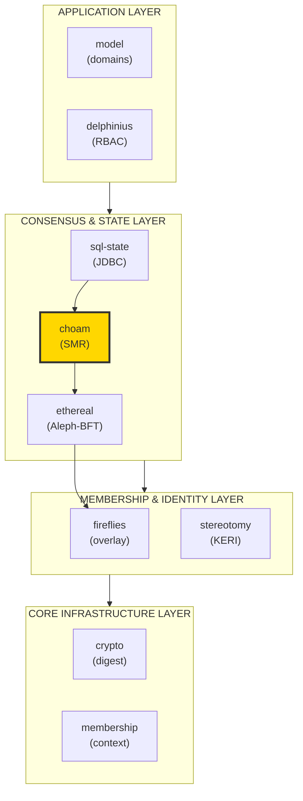
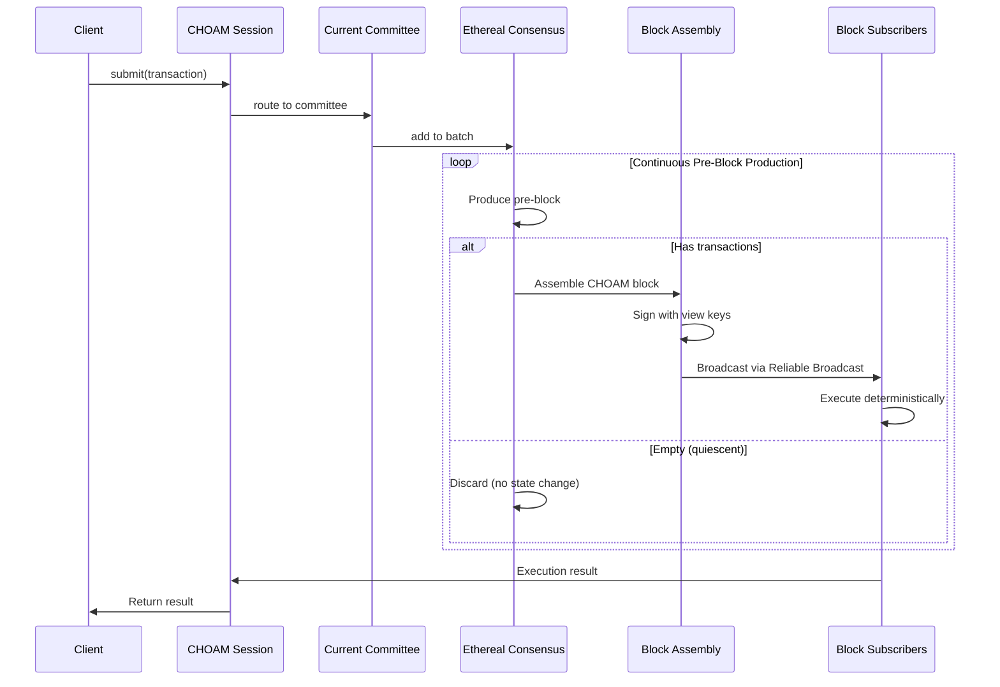
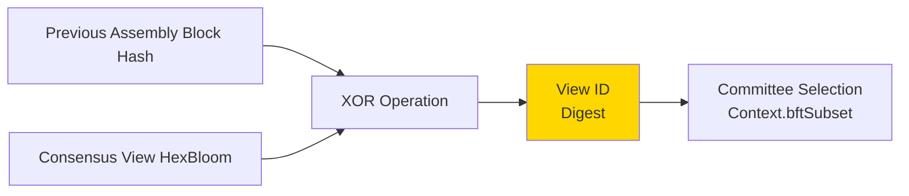
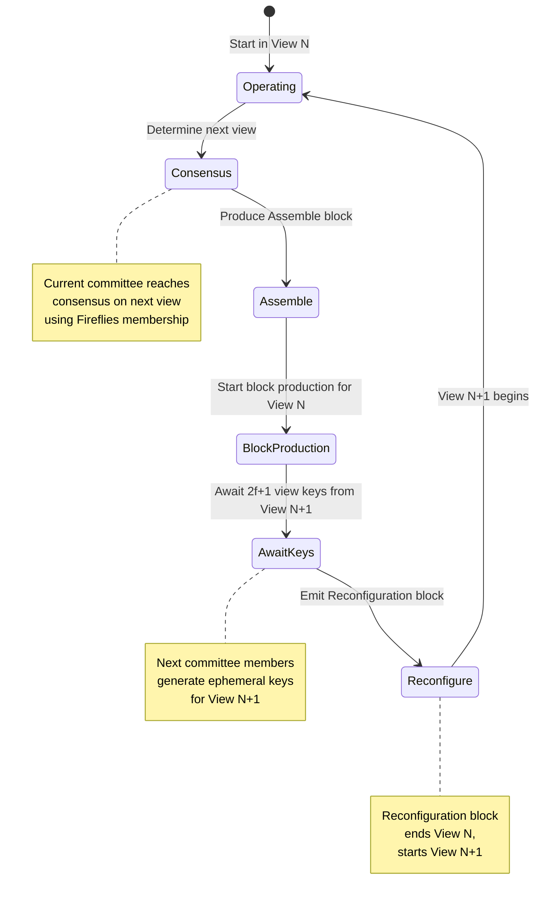
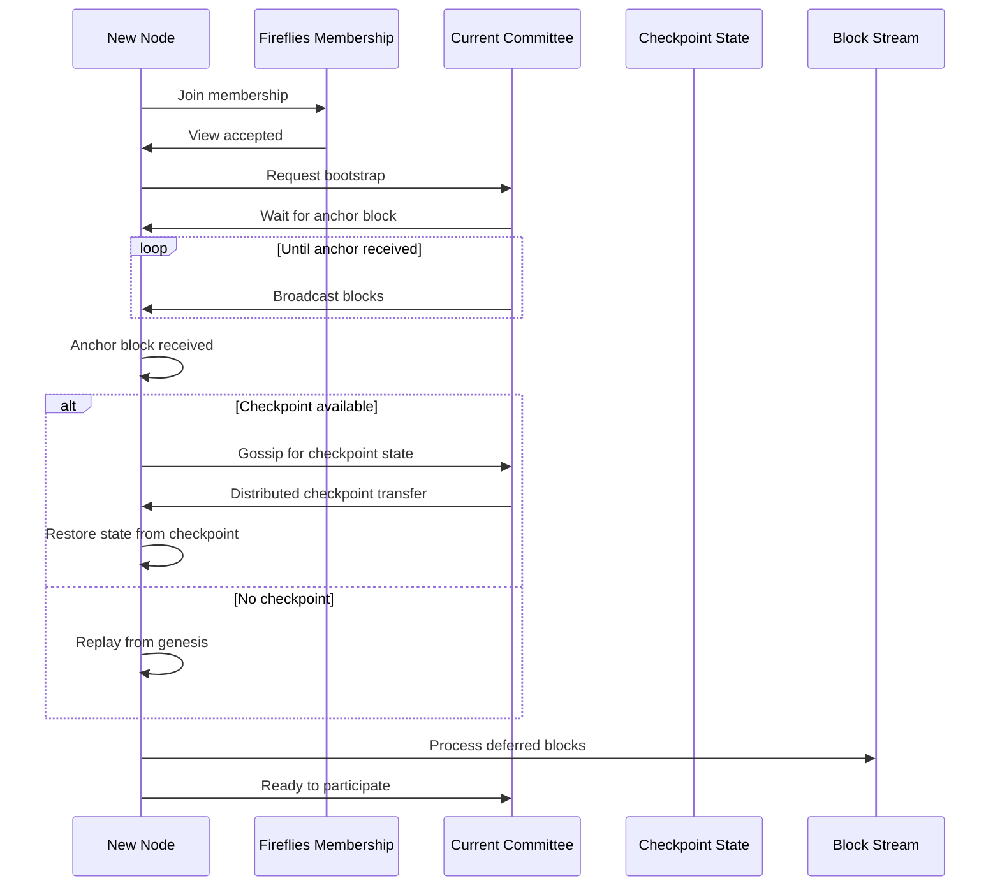

# CHOAM

_Committee-based State Machine Replication on linear distributed logs_

---

This module provides a CHOAM abstraction for committee management of linear distributed logs. This work is loosely based on ideas from two excellent papers:
- [From Byzantine Consensus to BFT State Machine Replication: A Latency-Optimal Transformation](https://www.researchgate.net/profile/Alysson_Bessani/publication/254037731_From_Byzantine_Consensus_to_BFT_State_Machine_Replication_A_Latency-Optimal_Transformation/links/562f872108ae4742240af924/From-Byzantine-Consensus-to-BFT-State-Machine-Replication-A-Latency-Optimal-Transformation.pdf)
- [From Byzantine Replication to Blockchain: Consensus is only the Beginning](https://arxiv.org/abs/2004.14527)

## Overview

One of the primary goals in Delos is distributed linear ledgers, composed of database DDL/DML command events. These are totally ordered transactions on a shared distributed ledger. This is equivalent to a Kafka event partition, in that this provides an ordered sequence of events - blocks - that all participants process in the same order. This is, unsuprisingly, the definition of _State Machine Replication_.

In Delos, however, the model is more complex than simple UTXO transactions. This module provides a committee selection mechanism that is maintained by signed blocks of batches of fundamental transactions. See [From Byzantine Replication to Blockchain: Consensus is only the Beginning](https://arxiv.org/abs/2004.14527) for discussion of the different types of blocks processed by CHOAM.

CHOAM differs from BFT-SMART in that CHOAM is asynchronous and leaderless. Rather than loosely coupling to a larger consensus as in BFT-SMART, CHOAM is tightly coupled with Ethereal (Aleph-BFT) and uses that subsystem to drive consensus behavior using a more primitive unit than blocks. View changes, checkpoints, and block generation are also leaderless and asynchronous, reusing the same Ethereal consensus model.

## Architecture Position



**CHOAM's role**: Routes client transactions to committees, manages committee rotation, produces signed blocks, handles checkpointing and bootstrapping.

## Design

### Committee-Based State Machine Replication

CHOAM uses **committees** - subsets of the total membership - to handle consensus for specific key ranges. This distributes load and enables horizontal scaling.

```mermaid
graph TB
    subgraph Membership["Full Membership (16 members)"]
        M1[Member 1]
        M2[Member 2]
        M3[Member 3]
        M4[Member 4]
        M5[Member 5]
        M6[Member 6]
        M7[Member 7]
        M8[Member 8]
        M9[Member 9]
        M10[Member 10]
        M11[Member 11]
        M12[Member 12]
        M13[Member 13]
        M14[Member 14]
        M15[Member 15]
        M16[Member 16]
    end

    subgraph Committee_A["Committee A (7 members)<br/>Key range: 0.0-0.5"]
        CA1[M1]
        CA2[M3]
        CA3[M5]
        CA4[M7]
        CA5[M9]
        CA6[M11]
        CA7[M13]
    end

    subgraph Committee_B["Committee B (7 members)<br/>Key range: 0.5-1.0"]
        CB1[M2]
        CB2[M4]
        CB3[M6]
        CB4[M8]
        CB5[M10]
        CB6[M12]
        CB7[M14]
    end

    M1 --> CA1
    M3 --> CA2
    M5 --> CA3
    M7 --> CA4
    M9 --> CA5
    M11 --> CA6
    M13 --> CA7

    M2 --> CB1
    M4 --> CB2
    M6 --> CB3
    M8 --> CB4
    M10 --> CB5
    M12 --> CB6
    M14 --> CB7

    style Committee_A fill:#d4edda
    style Committee_B fill:#d4edda
```



**Committee selection**:
- Committees chosen via **consistent hashing** of view ID
- Each committee handles transactions for specific key ranges
- BFT quorum (3f+1) within each committee
- Dynamic reconfiguration as membership changes

## Block Production

### Pre-Block Processing

Ethereal (Aleph) BFT produces pre-blocks _constantly_. These pre-blocks may not have any transactions at all. Consequently, in quiescence, where no client transactions are being serviced, these pre-blocks are useless and are consequently discarded. They do, however, contribute to the counters that drive View reconfiguration, and they certainly contribute to the liveness guarantees of CHOAM. However, they do not contribute to actual state change events, so they do not produce globally visible CHOAM blocks.



### Block Types

CHOAM processes different types of blocks for different purposes:

| Block Type | Purpose | Contains |
|------------|---------|----------|
| **Transaction Block** | Normal state changes | Client transactions, state updates |
| **Assemble Block** | Start view rotation | Consensus view diadem, next committee signal |
| **Reconfiguration Block** | Complete view rotation | View keys from next committee |
| **Checkpoint Block** | State snapshot | Merkle root of state, provenance chain |
| **Genesis Block** | Bootstrap new chains | Initial configuration, founding members |

## Views

Views go back to the dawn of group communication with ISIS, HORUS, and various permutations of such. A View's membership is defined by taking the View ID and using this to obtain the successors of that id (digest) across the view's Context Fireflies rings.

### View Identity

The ID of a view is the XOR of:
- The hash of the previous assembly block
- The consensus View HexBloom diadem determined for that assembly

This creates a pseudo-random function of the Digest algorithm byte width. In Delos, this is at minimum 32 bytes, providing an enormous amount of entropy. Granted, this could theoretically be gamed, but would require a 2/3's majority collaboration, so all right-thinking Scotsman will - by design - produce essentially unpredictable block hashes.



**Properties**:
- **Unpredictable**: Cannot predict next view ID without controlling 2/3+ members
- **Verifiable**: All members compute same view ID from same inputs
- **Committee determinism**: View ID determines committee via ring positions

## Asynchronous Joins (View Reconfiguration)

Periodically, CHOAM will change the committee. These committees are selected by the View IDs, as previously described.

### Reconfiguration Protocol



### Protocol Steps

1. **Determine consensus View**: Current committee agrees on Fireflies view for next committee
2. **Produce Assemble block**: Assembly block signals next committee to begin Join process
3. **Start block production**: Current view begins producing blocks for View N
4. **Await view keys**: Wait for at least 2/3+1 of next View's members to propose their ephemeral keys
5. **Emit Reconfiguration block**: Finalize view change with next committee's keys

The block production for each view is blocked until View consensus happens within the current Committee. Once a View has been selected, the Assemble block provides the signal to the joining members of the next committee to start the Join process.

CHOAM uses **ephemeral keys** for each member per view and the Join protocol is the process of collecting these keys from the next View's members and recording these keys in the corresponding Reconfiguration block produced at the end of processing for this view. The emitting of the Reconfiguration block is the end of the current view. The processing of the Reconfiguration block is the beginning of the processing of the next View.

**Key rotation**: View keys are generated per view and **deleted after view change** (by all right-thinking Scotsman) and never reused. A 2/3 + 1 threshold is required for any CHOAM consensus decision.

## Checkpointing and Bootstrapping

CHOAM provides a model for mitigating one of the more serious issues with distributed ledger technology: **Bootstrapping**.

In the production of work, CHOAM will periodically emit special _Checkpoint_ blocks that checkpoint the current state of the chain. When these checkpoints are processed, they eliminate the usefulness of the previous blocks before it that went into creating this checkpoint state and these blocks can be discarded. CHOAM keeps the View chain of reconfigurations all the way back to genesis, and it is this chain of reconfiguration blocks that prove the provenance of the Checkpoint and thus the state of the system maintained by the ledger.

### Bootstrap Protocol



**Bootstrap steps**:
1. Node joins common broadcast group via Fireflies
2. Special bootstrap process initiated
3. Node waits until a valid block is produced by external consensus
4. This block becomes the "anchor" block for secure bootstrapping
5. If checkpoint available, assemble via gossip (distributed load)
6. Restore state, process deferred blocks
7. Node ready to participate

**Network load distribution**: Checkpoint state assembly is distributed across membership via gossip, rather than punishing particular nodes. Once assembled, the state of the chain is restored, deferred blocks are processed, and the node is ready to participate.

**Archiving**: Full chain state can be gathered and moved to cold storage if desired. Facilities for performing this archiving in a highly available, exactly-once fashion will be provided in future releases.

## Finite State Machine Model

CHOAM is driven from a **Finite State Machine** model using Tron (another module in Delos). This manifests in the pattern of a leaf action driver in the form of _contexts_ that provide the leaf actions the Tron state machines.

### State Machine Components

Currently, the FSM model has 4 state maps:

| State Map | Purpose | Implementation |
|-----------|---------|----------------|
| **Mercantile** | Normal operation of the node | [Combine.java](src/main/java/com/hellblazer/delos/choam/fsm/Combine.java) |
| **Earner** | Block production | [Driven.java](src/main/java/com/hellblazer/delos/choam/fsm/Driven.java) |
| **Reconfigure** | View rotation | [Reconfiguration.java](src/main/java/com/hellblazer/delos/choam/fsm/Reconfiguration.java) |
| **BrickLayer** | Genesis bootstrapping | [Genesis.java](src/main/java/com/hellblazer/delos/choam/fsm/Genesis.java) |

The view reconfiguration logic provides dynamic rotation of view/committee members based on random cuts across the underlying context membership rings on the view context ID (digest). This balances the load across all available members.

## Messaging

### Client Transactions

Client transactions are submitted to the current members of the group using **Point to Point messaging**. The CHOAM session routes transactions to appropriate committee members based on transaction key hashing.

### Consensus Communication

Consensus block production uses **Ethereal Gossip** and is reused for view change and genesis bootstrapping consensus. In CHOAM, only a small subset of the total membership produces new blocks. Consequently, the other members of the CHOAM must somehow receive these blocks and do so reliably.

### Reliable Broadcast

The CHOAM group (context) uses a **Reliable Broadcast** from the _membership_ module to reliably distribute the blocks to all live members using a 2/3+1 variation of the Fireflies ring calculation. This protocol's message buffer is bounded and garbage collected and efficient in dissemination. As it is a garbage collected, bounded buffer broadcast, the messages will ultimately age out and be discarded.

**Liveness guarantee**: As join and recovery synchronization rely upon getting these messages, during periods of no transactions the last block is periodically rebroadcast to ensure joining members can bootstrap.

## Public API Reference

### Core Classes

#### `CHOAM` (Main Entry Point)

**Location**: `choam/src/main/java/com/hellblazer/delos/choam/CHOAM.java`

Main interface for state machine replication.

**Key Methods**:
- `start()` - Start CHOAM participant
- `stop()` - Stop and cleanup
- `session(): Session` - Get client session for transaction submission
- `currentView(): View` - Get current committee view
- `blockHeight(): long` - Get current block height

**Properties**:
- **Thread-safe**: Concurrent operations supported
- **Asynchronous**: Non-blocking operations
- **Reconfiguration-aware**: Handles view changes transparently

#### `Session` (Client Interface)

**Location**: `choam/src/main/java/com/hellblazer/delos/choam/Session.java`

Client session for transaction submission.

**Key Methods**:
- `submit(transaction: Transaction): CompletableFuture<Result>` - Submit transaction
- `submitBatch(txs: List<Transaction>): CompletableFuture<List<Result>>` - Batch submission
- `close()` - Close session

**Guarantees**:
- **Linearizability**: Operations appear atomic and in order
- **Retry logic**: Automatic retry on transient failures
- **View change handling**: Transparent committee rotation

#### `Block` (Replicated State)

**Location**: `choam/src/main/java/com/hellblazer/delos/choam/proto/Block.java`

Signed block on the replicated log.

**Key Fields**:
- `height: long` - Block sequence number
- `type: BlockType` - Transaction/Assemble/Reconfigure/Checkpoint/Genesis
- `body: ByteString` - Block payload (transactions or metadata)
- `hash: Digest` - Content hash
- `signatures: List<Signature>` - Committee member signatures

#### `Committee` (View Context)

**Location**: `choam/src/main/java/com/hellblazer/delos/choam/Committee.java`

Committee membership for current view.

**Key Methods**:
- `members(): Set<Member>` - Get committee members
- `viewId(): Digest` - Get view identifier
- `majority(): int` - Get BFT quorum size (2f+1)
- `isMember(member: Member): boolean` - Check membership

## Usage Examples

### 1. Start CHOAM Node

```java
// Prerequisites: Fireflies membership, Ethereal consensus
Context<Member> context = fireflies.currentView().getContext();
Ethereal ethereal = new Ethereal(params, identifier, context, router, metrics);

// Create CHOAM parameters
Parameters params = Parameters.newBuilder()
    .setCommitteeSize(7)
    .setCheckpointInterval(1000)  // Checkpoint every 1000 blocks
    .setViewRotationInterval(100) // Rotate every 100 blocks
    .build();

// Create and start CHOAM
CHOAM choam = new CHOAM(
    params,
    identifier,
    context,
    ethereal,
    router,
    metrics
);

choam.start();
```

### 2. Submit Client Transactions

```java
// Get session
Session session = choam.session();

// Submit single transaction
Transaction tx = new Transaction(ByteString.copyFromUtf8("INSERT INTO users ..."));
CompletableFuture<Result> future = session.submit(tx);

// Async handling
future.thenAccept(result -> {
    if (result.isSuccess()) {
        System.out.println("Transaction committed at block: " + result.blockHeight());
    } else {
        System.err.println("Transaction failed: " + result.error());
    }
});

// Batch submission
List<Transaction> batch = List.of(tx1, tx2, tx3);
session.submitBatch(batch).thenAccept(results -> {
    long successCount = results.stream().filter(Result::isSuccess).count();
    System.out.println("Committed: " + successCount + "/" + batch.size());
});
```

### 3. Subscribe to Block Stream

```java
// Process all blocks as they're produced
choam.blocks().subscribe(block -> {
    System.out.println("Block " + block.height() + " type: " + block.type());

    switch (block.type()) {
        case TRANSACTION:
            processTransactions(block);
            break;
        case RECONFIGURE:
            handleViewChange(block);
            break;
        case CHECKPOINT:
            saveCheckpoint(block);
            break;
    }
});
```

### 4. Monitor Committee Changes

```java
// Subscribe to view changes
choam.views().subscribe(view -> {
    System.out.println("Committee changed:");
    System.out.println("  View ID: " + view.viewId());
    System.out.println("  Members: " + view.members().size());
    System.out.println("  Quorum: " + view.majority());
});
```

### 5. Handle Checkpoints

```java
// Subscribe to checkpoint events
choam.checkpoints().subscribe(checkpoint -> {
    System.out.println("Checkpoint at height: " + checkpoint.height());

    // Save checkpoint state
    CheckpointState state = checkpoint.state();
    persistCheckpoint(state);

    // Prune old blocks before checkpoint
    choam.pruneBeforeHeight(checkpoint.height());
});
```

## Performance Characteristics

### Throughput
- **Typical**: 5,000-20,000 transactions/second per committee
- **Horizontal scaling**: Multiple committees process different key ranges
- **Bottleneck**: Ethereal consensus throughput

### Latency
- **Transaction commit**: ~500ms-1s (network dependent)
- **View rotation**: ~2-5 seconds
- **Checkpoint creation**: ~1-2 seconds

### Scalability
- **Committee size**: Typically 7-21 members
- **Total membership**: Tested with 100+ members
- **Multiple committees**: Distribute load across committees

## Metrics

CHOAM exposes operational metrics via Dropwizard Metrics.

**Source**: `choam/src/main/java/com/hellblazer/delos/choam/support/ChoamMetrics.java`

### Block Production (Meter)

| Metric | Description | Typical |
|--------|-------------|---------|
| `blocksProduced()` | Blocks produced per second | ~10-50/sec |
| `transactionBlocks()` | Transaction blocks | ~10-40/sec |
| `reconfigBlocks()` | Reconfiguration blocks | ~0.01/sec |
| `checkpointBlocks()` | Checkpoint blocks | ~0.1/sec |

### Transaction Processing (Timer)

| Metric | Description | Healthy Range |
|--------|-------------|---------------|
| `submitLatency()` | Client submit to result | p95 < 1s |
| `blockExecutionTime()` | Block execution duration | p95 < 100ms |

### Committee State (Gauge)

| Metric | Description |
|--------|-------------|
| `currentHeight()` | Current block height |
| `committeeSize()` | Current committee members |
| `viewEpoch()` | Current view number |
| `checkpointHeight()` | Latest checkpoint height |

## Testing and Validation

**Test Suite Location**: `choam/src/test/java/com/hellblazer/delos/choam/`

**Test Coverage**:
- **Functionality**: Transaction submission, block production, view rotation
- **Byzantine Behavior**: Malicious committee members, invalid blocks
- **View Changes**: Committee reconfiguration, key rotation
- **Checkpointing**: State snapshots, bootstrap from checkpoint
- **Performance**: Throughput and latency benchmarks

**Running Tests**:
```bash
# All CHOAM tests
./mvnw test -pl choam

# Specific test
./mvnw test -pl choam -Dtest=ReconfigurationTest

# Performance tests
./mvnw test -pl choam -Dtest=PerformanceTest -Dlarge_tests=true
```

## Status

CHOAM is currently **MVP status**. It's now very stable and fast enough to do serious simulations and provides the foundation for the next phase of transaction ordering and SQL event generation. Critical features such as view reconfiguration (periodic, pseudo-random committee BFT election), checkpointing, bootstrapping, etc. are currently provided. The system is stable through a very wide range of parameters, and while it may perform poorly when configured with extreme values, it will perform correctly.

## References

### Papers
- [From Byzantine Consensus to BFT State Machine Replication: A Latency-Optimal Transformation](https://www.researchgate.net/profile/Alysson_Bessani/publication/254037731_From_Byzantine_Consensus_to_BFT_State_Machine_Replication_A_Latency-Optimal_Transformation/links/562f872108ae4742240af924/From-Byzantine-Consensus-to-BFT-State-Machine-Replication-A-Latency-Optimal-Transformation.pdf)
- [From Byzantine Replication to Blockchain: Consensus is only the Beginning](https://arxiv.org/abs/2004.14527)

### Source Code
- **Main**: `choam/src/main/java/com/hellblazer/delos/choam/`
- **FSM**: `choam/src/main/java/com/hellblazer/delos/choam/fsm/`
- **Tests**: `choam/src/test/java/com/hellblazer/delos/choam/`
- **Protobuf**: `grpc/src/main/proto/choam.proto`

### Integration Points
- **Ethereal**: Asynchronous consensus (see `ethereal/README.md`)
- **Fireflies**: Membership and overlay (see `fireflies/README.md`)
- **SQL-State**: JDBC-accessible state machines (see `sql-state/README.md`)
- **Tron**: Finite state machine framework

---

**Last updated**: 2026-01-07
**Version**: 0.0.6-SNAPSHOT
**Status**: MVP - production-ready for serious simulations and transaction ordering
