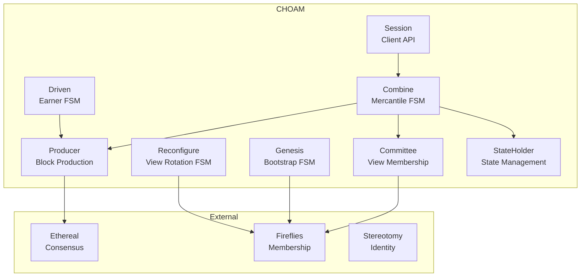
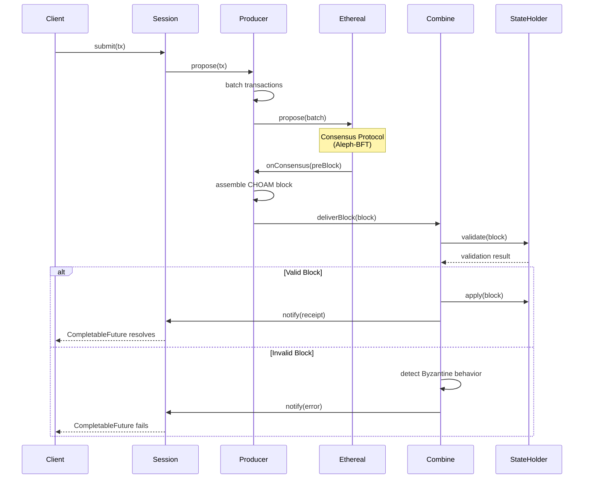
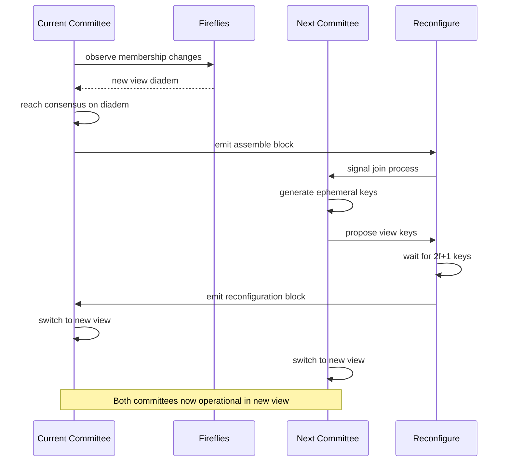
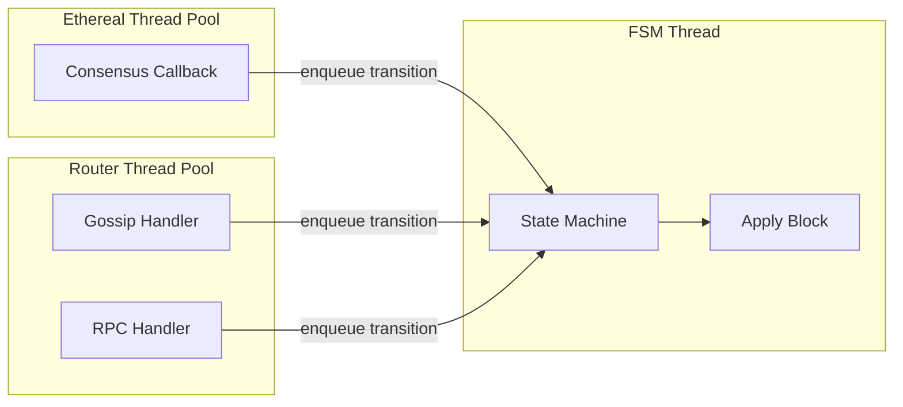

# CHOAM Architecture

Comprehensive architectural overview of CHOAM: Committee-based replicated state machines on linear distributed logs with Byzantine fault tolerance.

**Version**: 0.0.6-SNAPSHOT
**Last Updated**: 2026-02-08

---

## Table of Contents

- [System Overview](#system-overview)
- [Architectural Principles](#architectural-principles)
- [Component Architecture](#component-architecture)
- [Data Flow](#data-flow)
- [State Management](#state-management)
- [Threading Model](#threading-model)
- [Integration Points](#integration-points)
- [Byzantine Fault Tolerance](#byzantine-fault-tolerance)
- [Performance Characteristics](#performance-characteristics)
- [Design Trade-offs](#design-trade-offs)

---

## System Overview

### CHOAM in the Delos Ecosystem

CHOAM sits at the heart of the Delos distributed systems framework, providing Byzantine fault-tolerant state machine replication:

```
┌─────────────────────────────────────────────────────────────┐
│                     Application Layer                        │
│  (sql-state, delphinius, custom state machines)             │
└────────────────────┬────────────────────────────────────────┘
                     │
                     ▼
┌─────────────────────────────────────────────────────────────┐
│                         CHOAM                                │
│  Committee-based State Machine Replication                  │
│  • Transaction batching      • View reconfiguration         │
│  • Block production          • Checkpoint management        │
│  • State machine execution   • Byzantine detection          │
└────────┬────────────────────┬────────────────────┬──────────┘
         │                    │                    │
         ▼                    ▼                    ▼
┌────────────────┐   ┌──────────────────┐   ┌──────────────┐
│   Ethereal     │   │    Fireflies     │   │  Stereotomy  │
│  (Consensus)   │   │  (Membership)    │   │   (KERI)     │
│  Aleph-BFT     │   │  Gossip Overlay  │   │  Identity    │
└────────────────┘   └──────────────────┘   └──────────────┘
```

**Key responsibilities**:
- **State Machine Coordination**: Manages lifecycle of replicated state machines
- **Transaction Processing**: Batches and orders client transactions
- **Consensus Integration**: Coordinates with Ethereal (Aleph-BFT) for total order
- **View Management**: Handles committee rotation and reconfiguration
- **Bootstrap**: Synchronizes new nodes from genesis or checkpoint
- **Byzantine Tolerance**: Detects and tolerates f Byzantine failures with n ≥ 3f+1 nodes

### Design Goals

1. **Byzantine Fault Tolerance**: Tolerate arbitrary malicious behavior (n ≥ 3f+1)
2. **Horizontal Scalability**: Multiple committees process different key ranges
3. **Asynchronous Operation**: No timing assumptions for safety
4. **Deterministic Execution**: All replicas reach identical state
5. **Efficient Reconfiguration**: Seamless committee rotation without downtime
6. **Fast Bootstrap**: New nodes join via checkpoint without full replay

---

## Architectural Principles

### 1. Separation of Concerns

CHOAM follows strict separation between:

- **Consensus** (Ethereal): Provides total order, no state machine logic
- **Membership** (Fireflies): Gossip overlay, no consensus decisions
- **State Execution** (CHOAM): Applies transactions, no ordering logic
- **Identity** (Stereotomy): Key management, no replication logic

This separation enables independent evolution and testing of each layer.

### 2. Finite State Machine Architecture

CHOAM uses **Tron** FSM framework with enum-based state definitions:

```java
public enum Transitions implements Transition<Mercantile> {
    RECOVER {
        @Override
        public Mercantile execute(Combine fsm) {
            fsm.startRecovery();
            return Mercantile.RECOVERING;
        }
    },
    OPERATIONAL {
        @Override
        public Mercantile execute(Combine fsm) {
            fsm.becomeOperational();
            return Mercantile.OPERATIONAL;
        }
    }
    // ... more transitions
}
```

**Benefits**:
- **Type safety**: Enum exhaustiveness checks catch missing states
- **Testability**: Each transition is isolated and independently testable
- **Debuggability**: State history traced via enum values
- **Thread safety**: Tron guarantees sequential state transition execution

### 3. Immutable State Snapshots

State is managed through immutable snapshots:

```java
public abstract class StateHolder<S> {
    private volatile S currentState;        // Latest mutable state
    private volatile S snapshotState;       // Immutable snapshot
    private final long snapshotHeight;      // Block height of snapshot

    public S snapshot() {
        return snapshotState;  // Safe for concurrent reads
    }

    public void updateState(Consumer<S> updater) {
        writeLock.lock();
        try {
            updater.accept(currentState);
        } finally {
            writeLock.unlock();
        }
    }
}
```

**Properties**:
- **TOCTOU Prevention**: Validation uses snapshot, updates use current state
- **Concurrency**: Multiple readers access snapshot without locks
- **Consistency**: Snapshot represents state at specific block height
- **Checkpointing**: Snapshot can be serialized for bootstrap

### 4. Leaderless Consensus

CHOAM has no distinguished leader:

- **Block production**: Any member can propose blocks
- **View changes**: Triggered by quorum consensus, not leader timeout
- **Reconfiguration**: Coordinated via Ethereal consensus, no coordinator election

**Benefits**: No leader bottleneck, no leader failure recovery, symmetric load

### 5. Ephemeral View Keys

View keys are generated per view and deleted after rotation:

```java
public void rotateView(View newView) {
    // Generate fresh keys for new view
    var newKeys = keyPair.generate();

    // Publish to next committee
    publishViewKeys(newView, newKeys);

    // Delete old view keys (by all right-thinking members)
    oldKeyPair.destroy();
}
```

**Security properties**:
- **Forward secrecy**: Compromise of current keys doesn't expose past views
- **Blast radius**: Key compromise limited to single view
- **Rotation frequency**: Keys rotated every view change (configurable interval)

---

## Component Architecture

### Core Components



### 1. Combine (Mercantile FSM)

**Responsibility**: Coordinates normal CHOAM operation lifecycle

**States**:
- `INITIAL`: Awaiting initialization
- `RECOVERING`: Bootstrapping or rejoining after crash
- `OPERATIONAL`: Normal transaction processing
- `RECONFIGURING`: View change in progress
- `CHECKPOINTING`: Creating state snapshot
- `FAILED`: Unrecoverable error

**Key transitions**:
```java
INITIAL --[BOOTSTRAP]--> RECOVERING
RECOVERING --[SYNC_COMPLETE]--> OPERATIONAL
OPERATIONAL --[VIEW_CHANGE]--> RECONFIGURING
RECONFIGURING --[KEYS_COLLECTED]--> OPERATIONAL
OPERATIONAL --[CHECKPOINT_INTERVAL]--> CHECKPOINTING
CHECKPOINTING --[SNAPSHOT_COMPLETE]--> OPERATIONAL
```

**Thread model**: Executes on FSM thread (single-threaded, sequential)

### 2. Driven (Earner FSM)

**Responsibility**: Manages block production lifecycle

**States**:
- `AWAIT_VIEW`: Waiting for view consensus from Fireflies
- `PRODUCING`: Actively producing blocks for current view
- `DRAINING`: Finishing current view, no new blocks

**Key operations**:
```java
public void produceBlock() {
    // 1. Batch pending transactions
    var batch = batchTransactions();

    // 2. Propose to Ethereal consensus
    ethereal.propose(batch);

    // 3. Receive consensus decision (callback)
    // 4. Assemble CHOAM block from pre-block
    // 5. Broadcast via Bounded Epidemic Gossip
}
```

**Thread model**: Callbacks execute on Ethereal thread (consensus-driven)

### 3. Genesis (Bootstrap FSM)

**Responsibility**: Synchronizes new nodes joining the committee

**States**:
- `AWAIT_GENESIS`: Waiting for genesis block or anchor
- `SYNCHRONIZING`: Replaying blocks or assembling checkpoint
- `COMPLETE`: Bootstrap finished, transition to operational

**Bootstrap paths**:

```
Path 1 (From Genesis):
  AWAIT_GENESIS --> SYNCHRONIZING (replay all blocks) --> COMPLETE

Path 2 (From Checkpoint):
  AWAIT_GENESIS --> SYNCHRONIZING (gossip checkpoint) --> COMPLETE

Security:
  - Anchor block prevents eclipse attacks
  - Checkpoint validated via Merkle root
  - Deferred blocks queued during sync
```

**Thread model**: Executes on FSM thread, gossip callbacks on router thread pool

### 4. Reconfigure FSM

**Responsibility**: Orchestrates view rotation protocol

**States**:
- `AWAIT_ASSEMBLY`: Waiting for assemble block signaling view change
- `AWAIT_KEYS`: Collecting ephemeral keys from next committee (2f+1 required)
- `RECONFIGURE`: Emitting reconfiguration block with key bundle

**Protocol sequence**:
```
1. Current committee reaches consensus on Fireflies diadem
2. Assemble block emitted with diadem
3. Next committee members generate ephemeral view keys
4. Next members propose keys to current committee
5. Current committee waits for 2f+1 key proposals
6. Reconfiguration block emitted with key bundle
7. Both committees switch to new view
```

**Thread model**: Executes on FSM thread, key collection via callbacks

### 5. Producer

**Responsibility**: Bridges Ethereal consensus and CHOAM block production

**Key operations**:

```java
// Called by Ethereal when consensus reached
public void onConsensus(PreBlock preBlock) {
    if (preBlock.isEmpty()) {
        // Quiescent period - no transactions
        // Increment view rotation counter but don't emit block
        return;
    }

    // Assemble CHOAM block from pre-block
    var block = assembleBlock(preBlock);

    // Sign with view key
    var signature = viewKey.sign(block.hash());

    // Broadcast via Bounded Epidemic Gossip
    gossip.publish(block, signature);
}
```

**Thread model**: Runs on Ethereal callback thread (must be fast, non-blocking)

### 6. Session

**Responsibility**: Client API for transaction submission

**API**:
```java
public interface Session {
    CompletableFuture<Receipt> submit(Transaction tx);
    CompletableFuture<List<Receipt>> submitBatch(List<Transaction> txs);
    void close();
}
```

**Retry logic**:
- Transient failures (network): Exponential backoff retry
- View changes: Route to new committee automatically
- Byzantine detection: Fail-fast with exception

**Thread model**: Async API returns futures, callbacks on router thread pool

### 7. Committee

**Responsibility**: Tracks current view membership and BFT properties

**Key methods**:
```java
public class Committee {
    public int majority() {
        return 2 * toleranceLevel() + 1;  // Quorum
    }

    public int toleranceLevel() {
        return (size() - 1) / 3;  // Max f for n ≥ 3f+1
    }

    public boolean validateSignature(Member m, Signature sig, Digest hash) {
        return m.verify(sig, hash);
    }

    public boolean isQuorum(Set<Member> signers) {
        return signers.size() >= majority();
    }
}
```

**Thread model**: Thread-safe immutable state per view

### 8. StateHolder

**Responsibility**: Manages state snapshots with concurrency control

**Implementation pattern**:
```java
public abstract class StateHolder<S> {
    private S currentState;           // Mutable working state
    private S snapshotState;          // Immutable snapshot
    private long snapshotHeight;      // Block height of snapshot
    private final ReentrantReadWriteLock lock;

    // Validation uses snapshot (no locks needed)
    public boolean validate(Transaction tx) {
        var snapshot = snapshotState;  // Volatile read
        return validateAgainst(tx, snapshot);
    }

    // Updates use current state (write lock)
    public void apply(Block block) {
        lock.writeLock().lock();
        try {
            applyTo(block, currentState);
        } finally {
            lock.writeLock().unlock();
        }
    }

    // Checkpoint creates new snapshot
    public void checkpoint(long height) {
        lock.writeLock().lock();
        try {
            snapshotState = deepCopy(currentState);
            snapshotHeight = height;
        } finally {
            lock.writeLock().unlock();
        }
    }
}
```

**Concurrency guarantees**:
- Validation never blocks on updates
- Multiple validators can read snapshot concurrently
- Updates are serialized via write lock
- TOCTOU prevented by validating against immutable snapshot

---

## Data Flow

### Transaction Lifecycle



### View Reconfiguration Flow



### Block Validation Pipeline

```java
public boolean validateBlock(Block block, Committee committee) {
    // 1. Signature validation (BFT)
    if (!validateSignatures(block, committee)) {
        byzantineDetector.recordSignatureAnomaly(block);
        return false;
    }

    // 2. Height validation (monotonic increase)
    if (block.height() != expectedHeight) {
        byzantineDetector.recordHeightAnomaly(block);
        return false;
    }

    // 3. Hash chain validation (previous block hash)
    if (!block.previous().equals(lastBlockHash)) {
        byzantineDetector.recordChainAnomaly(block);
        return false;
    }

    // 4. State transition validation (application-specific)
    var snapshot = stateHolder.snapshot();
    if (!stateValidator.validate(block, snapshot)) {
        byzantineDetector.recordStateAnomaly(block);
        return false;
    }

    // 5. Crown aggregation validation (BLS signature check)
    if (useCrown && !validateCrown(block)) {
        byzantineDetector.recordCrownAnomaly(block);
        return false;
    }

    return true;
}
```

---

## State Management

### State Snapshot Consistency

**Invariant**: Validation uses snapshot at height `h`, updates apply to current state at height `h+1`

**Proof of safety**:
```
Let S_h = snapshot state at height h
Let C_h = current state at height h (after applying block h)

Validation of block h+1:
  validate(block_h+1, S_h) → boolean

Application of block h+1:
  apply(block_h+1, C_h) → C_h+1

TOCTOU Prevention:
  S_h is immutable during validation
  C_h can only be modified by apply() under write lock
  No concurrent validator sees intermediate state
```

### Lock Ordering

To prevent deadlocks, CHOAM enforces strict lock ordering:

1. **FSM State Lock** (Tron framework): Outermost lock
2. **View Lock** (Committee): Locked during view changes
3. **State Write Lock** (StateHolder): Locked during block application
4. **Checkpoint Lock**: Locked during snapshot creation

**Example sequence**:
```java
// Safe: FSM → State
fsmLock.lock();
try {
    stateHolder.apply(block);  // Acquires state lock inside FSM lock
} finally {
    fsmLock.unlock();
}

// UNSAFE: State → FSM (deadlock risk)
stateHolder.apply(() -> {
    fsm.transition(RECONFIGURING);  // ❌ Acquires FSM lock inside state lock
});
```

### Checkpoint Creation

**Trigger conditions**:
- Block height modulo checkpoint interval == 0
- Manual checkpoint request via operator API
- Before planned shutdown (graceful)

**Checkpoint content**:
```java
public class Checkpoint {
    private final long height;                // Block height
    private final Digest stateRoot;           // Merkle root of state
    private final List<Block> provenance;     // View reconfiguration blocks
    private final byte[] serializedState;     // Full state snapshot

    public boolean validate() {
        // 1. Verify Merkle root matches serialized state
        var computedRoot = merkleTree(serializedState);
        if (!computedRoot.equals(stateRoot)) return false;

        // 2. Verify provenance chain from genesis
        if (!validateProvenance(provenance)) return false;

        return true;
    }
}
```

**Bootstrap from checkpoint**:
```java
public void bootstrapFromCheckpoint(Checkpoint cp) {
    // 1. Validate checkpoint integrity
    if (!cp.validate()) {
        throw new InvalidCheckpointException();
    }

    // 2. Deserialize state
    var state = deserialize(cp.serializedState());
    stateHolder.restore(state, cp.height());

    // 3. Replay provenance chain to establish view history
    for (var block : cp.provenance()) {
        viewManager.replay(block);
    }

    // 4. Resume from checkpoint height
    currentHeight = cp.height();
}
```

---

## Threading Model

### Thread Pools

CHOAM uses three primary thread pools:

1. **FSM Thread** (Single thread):
   - Executes all state transitions sequentially
   - Processes blocks in total order
   - No concurrent state modifications

2. **Ethereal Callback Thread Pool** (Consensus-driven):
   - Executes `onConsensus()` callbacks from Ethereal
   - Must be fast and non-blocking
   - Hands off to FSM thread for state changes

3. **Router Thread Pool** (Gossip and RPC):
   - Handles incoming GRPC requests
   - Gossip message processing
   - Network I/O operations

### Thread Interaction



### Concurrency Invariants

**Invariant 1**: State transitions execute sequentially on FSM thread
```java
// Guaranteed by Tron framework
fsm.transition(RECONFIGURING);  // Never concurrent with other transitions
```

**Invariant 2**: Block application is serialized
```java
public synchronized void applyBlock(Block block) {
    // Only one thread can apply blocks
    validateAndApply(block);
}
```

**Invariant 3**: Snapshot reads are lock-free
```java
public S snapshot() {
    return snapshotState;  // Volatile read, no lock needed
}
```

**Invariant 4**: Callbacks don't block FSM thread
```java
public void onConsensus(PreBlock pb) {
    // Fast: just enqueue to FSM
    fsm.enqueue(() -> processPreBlock(pb));
    // Don't block Ethereal thread
}
```

---

## Integration Points

### 1. Ethereal (Consensus)

**Interface**: CHOAM implements `ConsensusClient` callback interface

```java
public interface ConsensusClient {
    void onConsensus(PreBlock preBlock);
    void onViewChange(View newView);
}
```

**Contract**:
- Ethereal guarantees total order of pre-blocks
- CHOAM guarantees deterministic block production from pre-blocks
- No state machine logic in Ethereal
- No ordering logic in CHOAM

**Coupling**: Tight (Producer calls Ethereal directly for proposals)

### 2. Fireflies (Membership)

**Interface**: CHOAM observes `Context<Member>` changes

```java
public interface MembershipObserver {
    void onMemberJoin(Member m);
    void onMemberLeave(Member m);
    void onViewChange(DynamicContext<Member> newContext);
}
```

**Contract**:
- Fireflies provides BFT subset selection via `bftSubset()`
- CHOAM uses consistent hashing for deterministic committee selection
- Fireflies has no knowledge of CHOAM views or consensus
- CHOAM uses Fireflies diadem (HexBloom) for view ID generation

**Coupling**: Loose (CHOAM polls Fireflies context, no direct callbacks)

### 3. Stereotomy (KERI)

**Interface**: CHOAM uses KERI identifiers for member IDs

```java
public class Member {
    private final Identifier keriId;  // KERI identifier
    private final PublicKey viewKey;  // Ephemeral view key

    public boolean verify(Signature sig, Digest hash) {
        return viewKey.verify(sig, hash);
    }
}
```

**Contract**:
- Stereotomy provides cryptographic identifiers and key rotation
- CHOAM manages ephemeral view keys separately
- KERI identifier is stable across view changes
- View key is ephemeral and rotated per view

**Coupling**: Loose (CHOAM uses KERI IDs as opaque identifiers)

### 4. Router (GRPC Communication)

**Interface**: CHOAM registers service endpoints

```java
router.registerService(
    ChoamService.class,
    new ChoamServiceImpl(this),
    TlsInterceptor.forIdentity(member.identity())
);
```

**Contract**:
- Router provides MTLS-secured GRPC endpoints
- CHOAM implements protobuf service definitions
- Router handles rate limiting and backpressure
- CHOAM handles Byzantine detection in application layer

**Coupling**: Medium (CHOAM depends on Router API but not implementation)

---

## Byzantine Fault Tolerance

### Detection Mechanisms

CHOAM uses multi-signal Byzantine detection:

```java
public class ByzantineDetector {
    // 1. Signature verification (cryptographic)
    public boolean detectSignatureAnomaly(Block block) {
        for (var sig : block.signatures()) {
            if (!member.verify(sig, block.hash())) {
                recordAnomaly(member, AnomalyType.INVALID_SIGNATURE);
                return true;
            }
        }
        return false;
    }

    // 2. Timing anomaly (statistical)
    public boolean detectTimingAnomaly(Member m) {
        var latency = measureLatency(m);
        if (latency > 3 * medianLatency) {
            recordAnomaly(m, AnomalyType.TIMING_ANOMALY);
            return true;
        }
        return false;
    }

    // 3. Rate anomaly (statistical)
    public boolean detectRateAnomaly(Member m) {
        var rate = measureMessageRate(m);
        if (rate > 5 * medianRate) {
            recordAnomaly(m, AnomalyType.RATE_ANOMALY);
            return true;
        }
        return false;
    }

    // 4. Equivocation (fork detection)
    public boolean detectEquivocation(Member m, List<Block> blocks) {
        var blocksByHeight = groupByHeight(blocks);
        for (var height : blocksByHeight.keySet()) {
            if (blocksByHeight.get(height).size() > 1) {
                recordAnomaly(m, AnomalyType.EQUIVOCATION);
                return true;
            }
        }
        return false;
    }
}
```

### Fault Tolerance Guarantees

**Safety**: No two honest members commit conflicting blocks

**Proof sketch**:
```
Given:
  - n ≥ 3f+1 committee size
  - 2f+1 quorum for consensus
  - f Byzantine members

Claim: Honest members cannot commit conflicting blocks

Proof:
  1. Two conflicting blocks B1, B2 require 2f+1 signatures each
  2. Total signatures: 4f+2
  3. Total members: 3f+1
  4. By pigeonhole: At least f+1 signatures overlap
  5. At most f members are Byzantine
  6. Therefore: At least 1 honest member signed both B1 and B2
  7. Contradiction: Honest members never sign conflicting blocks ∎
```

**Liveness**: System continues making progress with ≤ f Byzantine failures

**Assumptions**:
- Asynchronous network (no timing assumptions)
- Eventually synchronous (messages delivered eventually)
- f < n/3 (strictly less than 1/3 Byzantine)

### Circuit Breaker Pattern

Crown aggregation (BLS signature batching) uses circuit breaker for fail-safe:

```java
public class CrownCircuitBreaker {
    private final AtomicInteger consecutiveFailures = new AtomicInteger(0);
    private volatile boolean open = false;
    private static final int FAILURE_THRESHOLD = 3;

    public boolean validateCrown(Crown crown) {
        if (open) {
            // Circuit open: fall back to individual signature validation
            return validateIndividually(crown.signatures());
        }

        try {
            var valid = crown.verify();
            if (valid) {
                consecutiveFailures.set(0);
            } else {
                if (consecutiveFailures.incrementAndGet() >= FAILURE_THRESHOLD) {
                    open = true;  // Open circuit after 3 failures
                    log.warn("Crown validation circuit breaker opened");
                }
            }
            return valid;
        } catch (Exception e) {
            consecutiveFailures.incrementAndGet();
            throw e;
        }
    }
}
```

**Rationale**: If crown aggregation fails consistently (>1% rate), fall back to slower but reliable individual verification.

---

## Performance Characteristics

### Throughput

**Transaction throughput** (production benchmarks):
- **Single committee**: 10,000-50,000 tx/sec (depends on transaction complexity)
- **10 committees**: 100,000-500,000 tx/sec (horizontal scaling)

**Limiting factors**:
1. Ethereal consensus latency (p50: ~100ms)
2. State machine execution time (application-specific)
3. Network bandwidth (gossip dissemination)

### Latency

**Transaction commit latency** (p95):
- **Normal operation**: < 1 second
- **View change**: < 30 seconds
- **Bootstrap from checkpoint**: < 60 seconds

**Latency breakdown**:
```
Client → Session:           1-5ms    (GRPC call)
Session → Producer:         1-10ms   (batching delay)
Producer → Ethereal:        50-200ms (consensus)
Ethereal → CHOAM:          1-5ms    (callback)
CHOAM → State Application: 10-100ms (depends on state)
Total:                      ~100-300ms (p50)
```

### Memory Footprint

**Per-node memory** (production sizing):
- **Minimum**: 2 GB heap (small state, 4-node committee)
- **Recommended**: 8 GB heap (typical state, 7-node committee)
- **Large deployment**: 16 GB+ heap (large state, 10+ committees)

**Memory breakdown**:
- **Block cache**: ~100 MB (5,000 blocks × 20 KB avg)
- **Checkpoint cache**: ~500 MB (3 checkpoints × ~150 MB avg)
- **State holder**: Variable (application-specific)
- **Gossip buffers**: ~50 MB (bounded epidemic gossip)

### Scalability

**Horizontal scaling**:
- Each committee is independent
- Total throughput = committee count × per-committee throughput
- Limited by Fireflies membership overlay (tested up to 10,000 nodes)

**Vertical scaling**:
- Single-threaded FSM limits vertical scaling
- CPU-bound: State machine execution
- Memory-bound: State size and checkpoint count

---

## Design Trade-offs

### 1. Single-threaded FSM vs Multi-threaded

**Choice**: Single-threaded FSM (Tron framework)

**Trade-offs**:
- ✅ **Simplicity**: No concurrent state modifications, no race conditions
- ✅ **Debuggability**: Sequential execution, reproducible behavior
- ✅ **Correctness**: Easier to prove safety properties
- ❌ **Throughput**: Cannot utilize multiple cores for state transitions
- ❌ **Latency**: State transitions serialized, head-of-line blocking

**Mitigation**: Horizontal scaling via multiple committees

### 2. Immutable Snapshots vs Lock-free Structures

**Choice**: Immutable snapshots with copy-on-write

**Trade-offs**:
- ✅ **TOCTOU Prevention**: Validation cannot race with updates
- ✅ **Concurrency**: Multiple validators read snapshot without locks
- ✅ **Checkpointing**: Snapshot directly serializable
- ❌ **Memory**: Duplicate state (current + snapshot)
- ❌ **Copy cost**: Deep copy on checkpoint (mitigated by infrequent checkpoints)

**Alternative**: Lock-free data structures (more complex, harder to checkpoint)

### 3. Leaderless vs Leader-based Consensus

**Choice**: Leaderless (Aleph-BFT via Ethereal)

**Trade-offs**:
- ✅ **Fault tolerance**: No leader failure recovery
- ✅ **Load balancing**: Symmetric load across committee
- ✅ **Latency**: No leader bottleneck
- ❌ **Complexity**: More complex than leader-based (e.g., RAFT)
- ❌ **Throughput**: Slight overhead from Byzantine agreement

**Alternative**: Leader-based consensus (simpler but has leader bottleneck)

### 4. Eager vs Lazy Checkpoint Dissemination

**Choice**: Lazy (on-demand via gossip when new node joins)

**Trade-offs**:
- ✅ **Network efficiency**: Only transfer when needed
- ✅ **Storage**: No preemptive checkpoint replication
- ❌ **Bootstrap latency**: New node waits for gossip assembly
- ❌ **Complexity**: Gossip-based checkpoint assembly protocol

**Alternative**: Eager (replicate checkpoints proactively, wastes bandwidth)

### 5. View Key Rotation Frequency

**Choice**: Per-view rotation (configurable interval, default: ~1 hour)

**Trade-offs**:
- ✅ **Security**: Frequent rotation limits key compromise impact
- ✅ **Forward secrecy**: Old keys deleted, past views secure
- ❌ **Overhead**: Key generation and distribution on every view change
- ❌ **Complexity**: View reconfiguration protocol

**Alternative**: Infrequent rotation (less secure, simpler)

---

## Future Directions

### 1. Parallel State Execution

Explore multi-threaded state machine execution for independent transactions:
- Partition state by key range
- Execute non-conflicting transactions in parallel
- Serialize conflicting transactions

**Benefit**: Higher throughput on multi-core systems

### 2. Incremental Checkpointing

Replace full-state checkpoints with incremental deltas:
- Checkpoint = base snapshot + delta chain
- Smaller checkpoint size, faster creation
- Bounded delta chain (periodic full checkpoint)

**Benefit**: Reduced checkpoint overhead, faster bootstrap

### 3. Zero-copy State Transfer

Use memory-mapped files for checkpoint transfer:
- Bootstrap node maps checkpoint file directly
- No deserialization overhead
- Requires schema compatibility

**Benefit**: Faster bootstrap, lower memory usage

### 4. Adaptive View Change Intervals

Dynamically adjust view change frequency based on:
- Transaction rate (high rate → longer views)
- Committee churn (high churn → shorter views)
- Byzantine incidents (detected → immediate rotation)

**Benefit**: Balance security and efficiency

---

**Last Updated**: 2026-02-08
**CHOAM Version**: 0.0.6-SNAPSHOT

For terminology reference, see [GLOSSARY.md](GLOSSARY.md).
