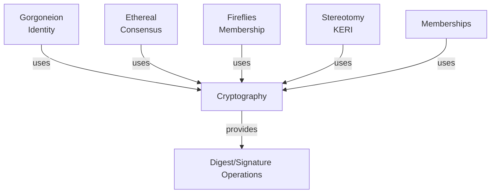

# Cryptography

_Self-describing digests, signatures, and keys that make Byzantine systems verifiable._

---

## Overview

The Cryptography module provides the foundational cryptographic operations for Delos. Rather than treating cryptography as a lower-level library, this module implements **self-describing digests** and **qualified signatures** - cryptographic identifiers that encode their own algorithm, allowing systems to verify operations without prior algorithm negotiation.

This approach is critical for Byzantine systems where participants may not trust external metadata. By embedding algorithm information directly in the digest or signature, Delos ensures that cryptographic identities are tamper-proof and portable across heterogeneous environments.

**Core Abstractions**:
- **Digest**: Self-describing cryptographic hash (algorithm + value encoded together)
- **Signature**: Self-describing digital signature (algorithm + signature bytes)
- **JohnHancock**: Qualified multi-signature support for Byzantine systems
- **HexBloom**: Efficient probabilistic set membership testing with privacy preservation

## Architecture Position

The Cryptography module is foundational to all other Delos layers:



**Role**: All cryptographic operations in Delos flow through this module. It provides self-describing, algorithm-agnostic identifiers.

**Dependencies**: Java stdlib, Bouncy Castle (optional for advanced algorithms)

**Consumers**: Every other Delos module (consensus, identity, membership, protocols)

## Design

### Self-Describing Digests

Traditional cryptographic systems require out-of-band knowledge of which hash algorithm produced a digest. The Delos approach embeds this information:

```
Digest = [Algorithm Tag: 1 byte] + [Hash Value: 32-64 bytes]
```

This allows digest comparison without protocol negotiation. A Digest object knows its own algorithm.

**Benefits**:
- Algorithm-agnostic design: Switch algorithms without protocol changes
- Portable identifiers: Digests work across different systems
- Byzantine-safe: Nodes can't claim different algorithms for same digest
- Self-validation: Digest format is self-evident

**Example**:
```
SHA-256 digest: 0x00 + [32 bytes SHA-256 hash]
SHA3-256 digest: 0x01 + [32 bytes SHA3-256 hash]
Blake2b-256: 0x02 + [32 bytes Blake2b hash]
```

### Qualified Signatures

Similarly, signatures encode their algorithm:

```
Signature = [Algorithm Tag: 1 byte] + [Signature Bytes: variable]
```

**Algorithms Supported**:
- **Ed25519**: EdDSA over Curve25519 (recommended)
- **RSA**: PKCS#1 v2.1 (RSASSA-PSS)
- **ECDSA**: P-256 / P-384 / P-521 (deprecated in favor of Ed25519)

### JohnHancock: Byzantine Multi-Signatures

JohnHancock provides a mechanism for encoding multiple signatures into a single structure, essential for Byzantine systems where consensus requires signatures from multiple participants.

**Features**:
- Flexible threshold signatures (m-of-n)
- BFT quorum: Typically 3f+1 nodes (f Byzantine faults)
- Efficient encoding: Only stores required signatures
- Verification: Validate threshold without extra metadata

**Use Case**: Gorgoneion uses JohnHancock to encode credentials signed by multiple identity witnesses.

### HexBloom: Privacy-Preserving Set Tests

HexBloom is a variant of Bloom filters that supports:
- Probabilistic set membership
- False positives (no false negatives)
- Privacy preservation through hashing
- Efficient updates

**Use Case**: Membership service uses HexBloom to track seen nonces and prevent replay attacks.

## Public API Reference

### Core Classes

#### `Digest` - Self-Describing Cryptographic Hash

**Location**: `src/main/java/com/hellblazer/delos/cryptography/Digest.java`

A 32-64 byte value that includes its hash algorithm. Digests are immutable and comparable.

**Key Methods**:
- `static Digest create(byte[] raw)` - Parse a digest from bytes
- `static Digest digest(DigestAlgorithm algo, byte[] content)` - Hash content into digest
- `byte[] toBytes()` - Get the encoded digest (algorithm tag + value)
- `String toHex()` - Hex string representation
- `DigestAlgorithm algorithm()` - Get the algorithm this digest uses
- `equals(Object o)` - Compare digests (algorithm-aware)
- `hashCode()` - Hash for collections

**Properties**:
- **Immutable**: Cannot be modified after creation
- **Comparable**: Implements Comparable<Digest>
- **Serializable**: Can be stored/transmitted

**Guarantees**:
- Same content hashed with same algorithm produces identical Digest
- Different algorithms produce different digests for same content
- Digest algorithm cannot be spoofed (part of the bytes)

**Integration Notes**:
- Used as identifiers throughout Delos (KERL event IDs, transaction IDs)
- Safe for JSON serialization via `toHex()`
- Collections should use HashSet<Digest> or HashMap<Digest, V>

**Example**:
```java
// Hash content into a digest
Digest d1 = Digest.digest(DigestAlgorithm.DEFAULT, "hello world".getBytes());

// Parse from bytes (with algorithm tag embedded)
Digest d2 = Digest.create(d1.toBytes());

// Both represent same content
assert d1.equals(d2);

// Serialize to hex for JSON/storage
String hex = d1.toHex();
```

#### `DigestAlgorithm` - Algorithm Registry and Operations

**Location**: `src/main/java/com/hellblazer/delos/cryptography/DigestAlgorithm.java`

Enum of supported hash algorithms. Each includes its tag, hash length, and operations.

**Key Methods**:
- `static DigestAlgorithm from(byte tag)` - Look up algorithm by tag
- `byte tag()` - Get the algorithm tag
- `int digestLength()` - Get hash output length (32 or 64 bytes)
- `Digest digest(byte[] content)` - Hash content
- `MessageDigest newDigest()` - Get a MessageDigest instance
- `Digest random()` - Generate random digest (for testing nonces)

**Algorithms**:
- `SHA_256` (tag 0x00) - Standard SHA-256, 32 bytes, **RECOMMENDED**
- `SHA3_256` (tag 0x01) - SHA3-256, 32 bytes
- `BLAKE2B_256` (tag 0x02) - BLAKE2b-256, 32 bytes
- `SHA_512` (tag 0x10) - SHA-512, 64 bytes

**Properties**:
- **Thread-safe**: All operations are thread-safe
- **Stateless**: No mutable state

**Static Fields**:
- `DEFAULT` - Recommended algorithm (currently SHA_256)

**Example**:
```java
DigestAlgorithm algo = DigestAlgorithm.DEFAULT;

// Hash some data
byte[] content = "test".getBytes();
Digest d = algo.digest(content);

// Round-trip through bytes
DigestAlgorithm parsed = DigestAlgorithm.from(d.toBytes()[0]);
assert parsed == algo;
```

#### `SignatureAlgorithm` - Signature Operations Registry

**Location**: `src/main/java/com/hellblazer/delos/cryptography/SignatureAlgorithm.java`

Registry of supported signature algorithms with their encoding, verification, and signing operations.

**Key Methods**:
- `static SignatureAlgorithm from(byte tag)` - Look up by tag
- `byte tag()` - Get algorithm tag
- `Verifier verifier(PublicKey key)` - Create verifier for public key
- `Signer signer(PrivateKey key)` - Create signer for private key
- `int signatureLength()` - Expected signature size

**Algorithms**:
- `ED_DSA` (tag 0x00) - Edwards-curve Digital Signature Algorithm (Ed25519), **RECOMMENDED**
- `RSA_PSS` (tag 0x01) - RSA PKCS#1 v2.1 (RSASSA-PSS), 256 bytes
- `ECDSA_P256` (tag 0x10) - ECDSA with P-256, 64 bytes
- `ECDSA_P384` (tag 0x11) - ECDSA with P-384, 96 bytes

**Properties**:
- **Ed25519 RECOMMENDED**: 64-byte signatures, secure against quantum in some models
- **RSA**: Larger signatures but longer key lifetime
- **ECDSA**: Deprecated in favor of Ed25519

**Static Field**:
- `DEFAULT` - Recommended algorithm (currently ED_DSA)

**Example**:
```java
// Get a signer for a private key
SignatureAlgorithm algo = SignatureAlgorithm.DEFAULT;
PrivateKey key = generatePrivateKey();
Signer signer = algo.signer(key);

// Sign some content
byte[] content = "message".getBytes();
byte[] signature = signer.sign(content);

// Get a verifier for corresponding public key
PublicKey pub = getPublicKey(key);
Verifier verifier = algo.verifier(pub);

// Verify signature
assert verifier.verify(signature, content);
```

#### `JohnHancock` - Byzantine Multi-Signatures

**Location**: `src/main/java/com/hellblazer/delos/cryptography/JohnHancock.java`

Multi-signature container for Byzantine threshold signatures (e.g., 2-of-3, 3-of-4).

**Key Methods**:
- `static JohnHancock create(SignatureAlgorithm algo, List<byte[]> signatures)` - Create from signatures
- `add(byte[] signature)` - Add another signature
- `signatures()` - Get list of signatures
- `toBytes()` - Encode for transmission
- `static JohnHancock from(byte[] bytes)` - Decode from bytes

**Properties**:
- **Threshold-agnostic**: Stores all signatures; threshold checked externally
- **Variable size**: Only stores signatures that are present
- **Algorithm-tagged**: Encodes algorithm for all signatures

**Guarantees**:
- All signatures use the same algorithm
- Order preserved for forensics

**Integration Notes**:
- Used by Gorgoneion for credential signatures (typically 3-of-5 or 7 witnesses)
- Threshold validation happens outside JohnHancock
- Not thread-safe; wrap if needed for concurrent access

**Example**:
```java
// Collect signatures from multiple signers
List<byte[]> sigs = new ArrayList<>();
for (Signer signer : signers) {
    sigs.add(signer.sign(content));
}

// Create multi-signature (2-of-3 signatures collected)
JohnHancock hancock = JohnHancock.create(SignatureAlgorithm.DEFAULT, sigs);

// Serialize for transmission
byte[] encoded = hancock.toBytes();

// Later: parse and verify
JohnHancock decoded = JohnHancock.from(encoded);
for (byte[] sig : decoded.signatures()) {
    assert verifier.verify(sig, content);
}
```

#### `Signer` - Signature Creation

**Location**: `src/main/java/com/hellblazer/delos/cryptography/Signer.java`

Interface for signing operations.

**Key Methods**:
- `byte[] sign(byte[] content)` - Create signature for content
- `byte[] sign(byte[]... content)` - Sign multiple content blocks (concatenated)

**Properties**:
- **Deterministic**: Same content produces same signature
- **Blocking**: Synchronous signing (fast for Ed25519, slower for RSA)

#### `Verifier` - Signature Verification

**Location**: `src/main/java/com/hellblazer/delos/cryptography/Verifier.java`

Interface for signature verification.

**Key Methods**:
- `boolean verify(byte[] signature, byte[] content)` - Verify signature
- `void verifyThrows(byte[] signature, byte[] content)` - Verify, throw if invalid

**Properties**:
- **Deterministic**: Same signature/content always gives same result
- **Stateless**: No side effects from verification

---

## Performance Characteristics

### Throughput

- **Ed25519 signatures**: ~10,000 signatures/sec on single core
- **Ed25519 verification**: ~5,000 verifications/sec on single core
- **SHA-256 hashing**: ~300 MB/sec
- **RSA signing**: ~100 signatures/sec (slower, larger keys)
- **HexBloom membership test**: ~1M tests/sec

**Bottleneck**: Public key cryptography; hashing is negligible.

**Scaling**: All operations scale linearly with thread count (embarrassingly parallel).

### Latency

- **Ed25519 signature**: < 0.1ms
- **Ed25519 verification**: < 0.2ms
- **SHA-256 hash (32KB)**: < 0.1ms
- **RSA-2048 signature**: 10-20ms (hardware dependent)

### Resource Usage

- **Memory**: Digests 32-64 bytes each; signatures 64-256 bytes depending on algorithm
- **CPU**: Dominated by public key ops; use hardware acceleration if available
- **Network**: Minimal overhead; signatures/digests are small

---

## Testing and Validation

**Test Suite Location**: `src/test/java/com/hellblazer/delos/cryptography/`

**Total Tests**: 15+ test classes covering digest operations, signatures, and algorithms

### Running Tests

```bash
# All cryptography tests
./mvnw test -pl cryptography

# Specific algorithm tests
./mvnw test -pl cryptography -Dtest=DigestAlgorithmTest

# Performance tests
./mvnw test -pl cryptography -Dlarge_tests=true
```

### Test Categories

- **Digest tests**: Round-trip encoding, algorithm parsing, comparison
- **Signature tests**: Sign/verify, multi-signature collection
- **Algorithm tests**: Enum operations, tag management
- **Interop tests**: Cross-algorithm compatibility checks

---

## Troubleshooting

### "Unsupported algorithm tag: 0x05"

**Cause**: Received a Digest/Signature with unknown algorithm tag.

**Diagnosis**:
- Check that all nodes are running the same Delos version
- Verify cryptography module was built correctly

**Resolution**:
- Ensure all nodes upgraded to a version that supports the algorithm
- Or downgrade to earlier version that doesn't use the unknown algorithm

### Performance degradation in signature verification

**Causes**:
1. Hardware lacks AES-NI or similar crypto acceleration
2. Thread pool exhaustion
3. RSA keys in use (much slower than Ed25519)

**Diagnosis**:
- Check CPU flags: `grep aes /proc/cpuinfo` (Linux)
- Review active thread count: `jstack [pid] | grep tid | wc -l`
- Check signature algorithm in use

**Resolution**:
- Enable hardware acceleration in JVM: `-XX:+UnlockDiagnosticVMOptions -XX:+UseAES`
- Switch to Ed25519 if using RSA
- Increase thread pool size for verification work

---

## Status

**Current Status**: Production-ready (since 2024-Q2)

**Implemented Features**:
- ✓ Self-describing Digest with algorithm tags
- ✓ Ed25519, RSA-PSS, ECDSA signature support
- ✓ JohnHancock multi-signature container
- ✓ HexBloom probabilistic set membership
- ✓ Key generation and management
- ✓ Certificate support (cert/ submodule)

**Known Limitations**:
- ECDSA deprecated (use Ed25519 instead)
- RSA only recommended for long-term key storage (signatures slow)
- HexBloom is probabilistic (false positives possible, no false negatives)

---

## References

### Source Code Locations

- **Main**: `src/main/java/com/hellblazer/delos/cryptography/`
  - `Digest.java` - Self-describing digests
  - `DigestAlgorithm.java` - Digest algorithm registry
  - `SignatureAlgorithm.java` - Signature algorithm registry
  - `Signer.java` / `Verifier.java` - Signing interfaces
  - `JohnHancock.java` - Multi-signature container
  - `HexBloom.java` - Probabilistic set membership

- **Certificates**: `src/main/java/com/hellblazer/delos/cryptography/cert/`
  - Certificate generation and management

- **SSL/TLS**: `src/main/java/com/hellblazer/delos/cryptography/ssl/`
  - MTLS configuration (used by protocols module)

- **Tests**: `src/test/java/com/hellblazer/delos/cryptography/`

### Related Modules

- **Protocols**: Uses cryptography for MTLS - see `protocols/README.md`
- **Gorgoneion**: Uses Digest/Signature for identity - see `gorgoneion/README.md`
- **Stereotomy**: Uses cryptographic operations for KERI - see `stereotomy/README.md`

### External Resources

- **RFC 8032**: Edwards-Curve Digital Signature Algorithm (EdDSA)
- **FIPS 186-5**: Digital Signature Standard (DSS)
- **Bouncy Castle**: `https://www.bouncycastle.org/` (underlying crypto provider)

---

Last Updated: 2026-01-09
Status: Foundation Module
Module Type: Cryptographic Foundation
