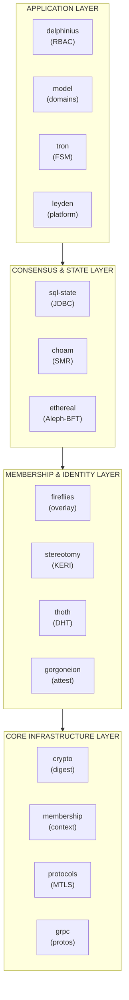
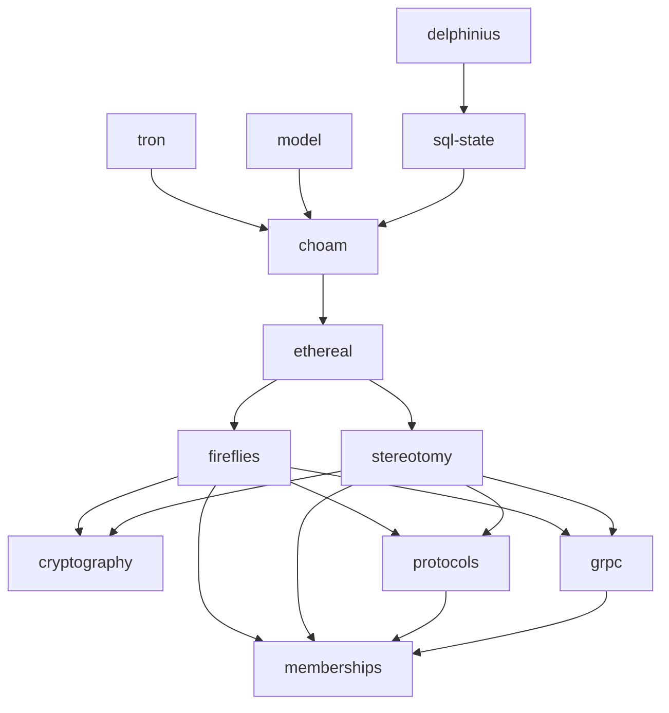
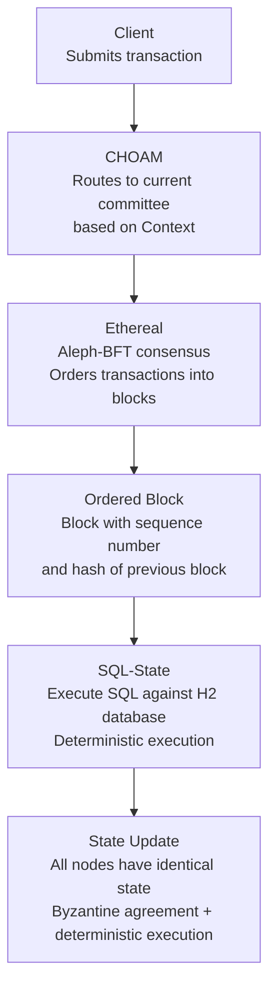
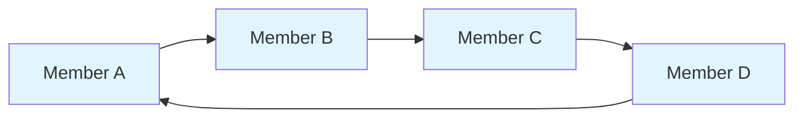
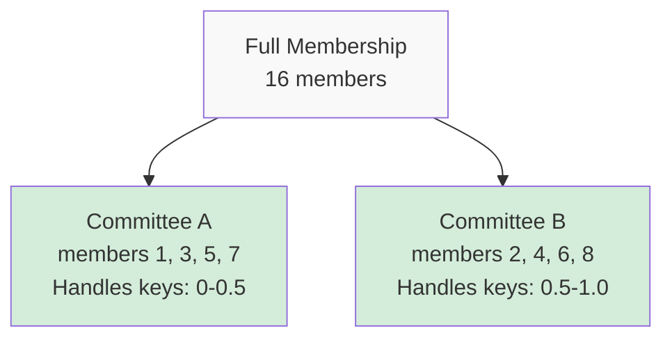

# Delos Architecture

This document provides visual architecture diagrams and explanations of the Delos distributed systems platform.

---

## Table of Contents

- [High-Level Overview](#high-level-overview)
- [Layer Architecture](#layer-architecture)
- [Module Dependencies](#module-dependencies)
- [Consensus Data Flow](#consensus-data-flow)
- [Network Topology](#network-topology)
- [Key Abstractions](#key-abstractions)

---

## High-Level Overview

Delos is a **multi-tenant distributed database platform** providing Byzantine fault-tolerant consensus, decentralized identity management, and replicated SQL state machines. It's designed for wide-area distributed systems requiring high security and verifiable operations.

**Core Capabilities**:
- Byzantine fault tolerance (BFT) with 3f+1 quorum
- KERI-based decentralized identity (no central CA)
- Replicated SQL databases with JDBC interface
- Relation-based access control (Zanzibar-style)
- Multi-tenant isolation with GraalVM

---

## Layer Architecture

Delos is organized into four logical layers, each building on the layer below:



### Layer 1: Core Infrastructure

**Purpose**: Fundamental building blocks used by all other layers.

- **cryptography**: Self-describing cryptographic primitives
  - `Digest`: Content-addressed identifiers
  - `Signature`: Self-describing digital signatures
  - `Identifier`: Self-describing identifiers for entities
  - Bloom filters for membership sets

- **memberships**: Context abstraction and ring communication
  - `Context`: Logical grouping of members (like cluster ID)
  - `Member`: Identity and location of a node
  - Ring-based communication patterns (successor/predecessor)
  - gRPC routing by context

- **protocols**: gRPC MTLS fundamentals
  - MTLS with KERI certificate validation
  - Rate limiters and flow control
  - Service fundamentals

- **grpc**: Centralized Protocol Buffer definitions
  - All `.proto` files for inter-service communication
  - Generated gRPC stubs and message classes

### Layer 2: Membership & Identity

**Purpose**: Establish and maintain secure membership with decentralized identity.

- **fireflies**: Byzantine fault-tolerant membership service
  - Stable, virtually synchronous views (Rapid-inspired)
  - BFT join protocol (requires majority agreement)
  - Ring-based gossip for state dissemination
  - Failure detection and view consensus

- **stereotomy**: KERI implementation for decentralized identity
  - Key Event Receipt Infrastructure (no central CA)
  - Cryptographic rotation and recovery
  - Self-certifying identifiers
  - MTLS certificate validation

- **thoth**: Distributed hash table for key management
  - Stores KERI key event logs (KELs)
  - Chord-based routing
  - Replicated storage with BFT

- **gorgoneion**: Identity bootstrapping and attestation
  - Secure node provisioning
  - Attestation of node identity
  - Secrets management

### Layer 3: Consensus & State

**Purpose**: Achieve consensus on transaction order and maintain replicated state.

- **ethereal**: Aleph-BFT asynchronous consensus
  - DAG-based consensus (no leader bottleneck)
  - Asynchronous (no timing assumptions)
  - BFT with 3f+1 quorum
  - Outputs totally ordered blocks

- **choam**: Committee-based state machine replication
  - Linear log of ordered transactions
  - Committee rotation for load distribution
  - Reconfiguration support (membership changes)
  - Checkpoint and recovery

- **sql-state**: JDBC-accessible SQL state machines
  - H2 database with deterministic execution
  - Liquibase for schema management
  - JOOQ for type-safe queries
  - Replicated across all nodes

### Layer 4: Application

**Purpose**: Application-level services built on consensus and state.

- **delphinius**: Relation-based access control (Zanzibar-style)
  - Namespace, object, relation, subject tuples
  - Transitive permission checks
  - Backed by SQL-State

- **tron**: Finite state machine framework
  - Type-safe FSM using Java enums
  - Transition validation
  - State persistence

- **model**: Process domains and multi-tenant sharding
  - Domain abstraction for multi-tenancy
  - Shard management
  - Process isolation

- **leyden**: Platform support features
  - Additional platform-specific capabilities

**Isolation Support**:
- **isolates**: GraalVM isolate-based enclaves
  - True multi-tenant isolation at OS level
  - Separate heap spaces per tenant
  - Requires GraalVM 24.0.2+

---

## Module Dependencies

This diagram shows the primary dependencies between major modules:



**Key Dependencies**:
- Everything depends on `cryptography` (Digest, Signature)
- Consensus (`ethereal`, `choam`) depends on membership (`fireflies`)
- State (`sql-state`) depends on consensus (`choam`)
- Applications depend on state and/or consensus
- All modules use `grpc` for inter-node communication

---

## Consensus Data Flow

This shows how a client transaction flows through the system:



**Transaction Lifecycle**:

1. **Submission**: Client submits transaction to any CHOAM node
2. **Routing**: Transaction routed to current committee members
3. **Consensus**: Ethereal orders transaction via Aleph-BFT
4. **Execution**: SQL-State executes transaction deterministically
5. **Replication**: All nodes execute same transaction sequence → identical state

**Key Properties**:
- **Total order**: All nodes see same transaction sequence
- **Determinism**: Same inputs always produce same outputs
- **Byzantine fault tolerance**: Works even if f<n/3 nodes are malicious
- **Asynchronous**: No timing assumptions required

---

## Network Topology

### Ring-Based Gossip (Fireflies)

Each member has a position on a consistent hash ring based on its identifier:



Ring positions: A → B → C → D → A (circular)

**Gossip pattern**:
- Each member gossips with successors and predecessors
- Redundant paths ensure Byzantine fault tolerance
- Bloom filters track gossip state efficiently
- Ring structure provides O(log n) paths between any two members

### Committee-Based Consensus (CHOAM)

Committees are subsets of members responsible for consensus:



**Committee selection**:
- Committees chosen via consistent hashing
- BFT quorum within each committee (3f+1)
- Load distribution across multiple committees
- Dynamic reconfiguration as membership changes

---

## Key Abstractions

### Context

A **Context** is a logical grouping of members, similar to a cluster ID. All members in a context:
- Share a common ring structure
- Participate in the same gossip protocol
- Achieve consensus on membership views

**Example**: A production deployment might have separate contexts for different tenants or geographic regions.

### Member

A **Member** represents a node in the system with:
- **Identity**: KERI-based self-certifying identifier
- **Location**: Network address (host, port)
- **Note**: Signed metadata (certificate equivalent)

Members communicate via gRPC with MTLS using KERI for certificate validation.

### View

A **View** represents a consistent snapshot of membership:
- **Members**: Set of all members in the context
- **Epoch**: Monotonically increasing version number
- **Crown**: Cryptographic hash of membership set
- **Bloom filter**: Compact membership representation

Views change only by consensus (BFT voting).

### Digest

A **Digest** is a self-describing content-addressed identifier:
```
<algorithm><hash_bytes>
```

Used for:
- Content addressing (blocks, transactions, states)
- Cryptographic binding (crown, view IDs)
- Cache keys and deduplication

**Example**: `SHA256:<32_bytes>` uniquely identifies content.

### CHOAM Session

A **CHOAM Session** manages transaction submission:
- Batching for efficiency
- Retry logic for failures
- Result tracking
- View change handling

Provides linearizable operations (sequential consistency).

---

## Putting It All Together

### Bootstrapping a Cluster

1. **Identity generation** (stereotomy): Each node generates KERI identifier
2. **Join protocol** (fireflies): New node contacts seed, acquires membership view
3. **Gossip discovery**: Node fills out full membership via ring gossip
4. **Consensus participation** (ethereal, choam): Node joins committees and votes
5. **State synchronization** (sql-state): Node catches up on replicated state

### Processing a Transaction

1. **Client** submits SQL transaction via JDBC
2. **sql-state** packages transaction for CHOAM
3. **CHOAM** routes to committee based on key hash
4. **Ethereal** achieves consensus on transaction order within committee
5. **CHOAM** assembles ordered block from consensus output
6. **sql-state** executes transaction deterministically on all nodes
7. **Client** receives result once majority commits

### Handling Failures

**Node failure**:
- Fireflies detects failure via gossip timeout
- View change proposed and voted on
- New view excludes failed node
- Committees rebalanced to maintain quorum

**Byzantine behavior** (malicious node):
- Invalid signatures rejected (KERI validation)
- Consensus requires 3f+1 honest nodes
- Bloom filter prevents membership lies
- View voting detects inconsistent observations

---

## Related Documentation

**Module deep-dives** *(coming soon)*:
- fireflies/README.md - Detailed membership protocol
- ethereal/README.md - Aleph-BFT consensus details
- choam/README.md - State machine replication
- sql-state/README.md - Replicated SQL databases
- stereotomy/README.md - KERI identity management

**Current documentation**:
- [DEVELOPER_QUICKSTART.md](DEVELOPER_QUICKSTART.md) - Get started building Delos
- [DEPLOYMENT_GUIDE.md](DEPLOYMENT_GUIDE.md) - Production deployment *(coming soon)*
- [GLOSSARY.md](GLOSSARY.md) - Term definitions *(coming soon)*

---

**Last updated**: 2026-01-07
**Version**: 0.0.5-SNAPSHOT
