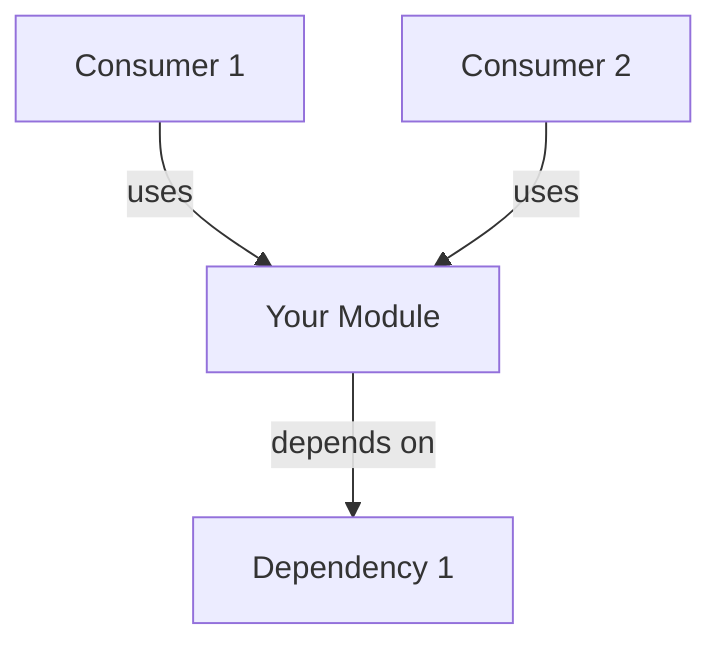
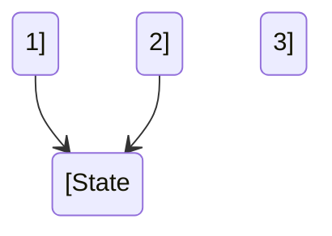
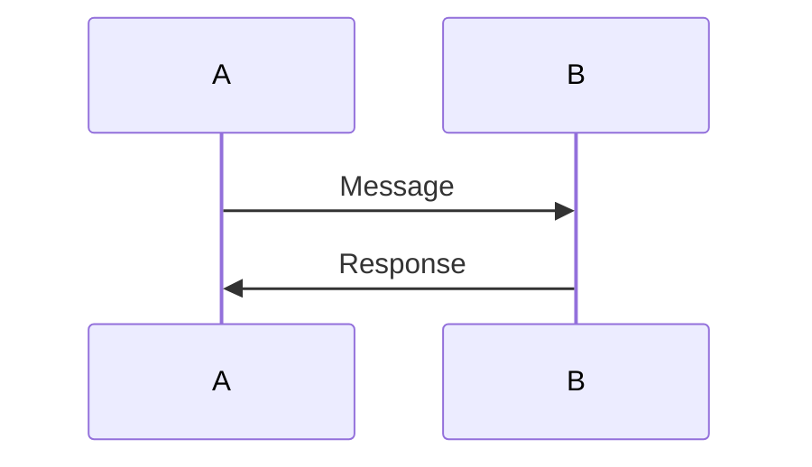

# Module Documentation Template

This template provides a standardized structure for documenting Delos modules. Use this as a guide to ensure consistent, comprehensive documentation across the codebase.

## When to Use This Template

Apply this template to:
- New modules being created
- Existing modules being documented or updated
- Modules with minimal existing documentation

The template is designed to support modules of varying complexity. Expand or contract sections based on your module's scope.

---

## Template Structure

```markdown
# [Module Name]

_[Optional: 1-sentence witty/poetic description]_

---

## Overview

[2-4 paragraphs explaining]:
- The core abstraction this module provides
- Why it exists and what problem it solves
- Design philosophy and positioning in Delos
- [Optional: Academic paper references if applicable]

Example: "Fireflies implements Byzantine Fault-Tolerant membership service using a gossip protocol. Unlike traditional membership protocols that require consensus on membership changes, Fireflies uses probabilistic infection-style gossip to detect failures. This approach scales to thousands of nodes and tolerates Byzantine nodes sending conflicting information."

## Architecture Position

[Include a Mermaid diagram showing how this module fits in the stack]



**[Module Name]'s role in Delos**:
- [Key responsibility 1]
- [Key responsibility 2]
- [Key responsibility 3]

**Dependencies**: [List modules this depends on]

**Consumers**: [List modules that depend on this]

## Design

[Break down major design concepts into subsections]

### [Design Concept 1: e.g., "View-based Membership"]

[2-3 paragraphs explaining the concept]

[Include Mermaid diagram if applicable]

### [Design Concept 2: e.g., "Gossip Protocol"]

[Explanation with subsections as needed]

### [Design Concept 3]

[More detailed explanation]

## Algorithm Overview / Protocol Details

[For consensus/complex modules, document the algorithm]

### [Component 1 Structure]

**Definition**: [What this is and its purpose]

**Properties**:
- [Property 1]: [Explanation]
- [Property 2]: [Explanation]

**Validity Requirements**:
- [Requirement 1]
- [Requirement 2]

**Example Structure**:
```
[Show the structure or format]
```

### [Component 2 Progression]

**Phases**:
1. **[Phase Name]**: [Description and goals]
2. **[Phase Name]**: [Description and goals]

**State Machine**:


### [Component 3 Mechanism]

**Key Decision Logic**: [Explanation]

**Guarantees**:
- [Safety guarantee]
- [Liveness guarantee]

**Example Flow**:


## Public API Reference

### Core Classes

#### `[ClassName]` - [Brief Purpose]

**Location**: `src/main/java/com/hellblazer/delos/[module]/[ClassName].java`

[1-2 sentence explanation of what this class does]

**Key Methods**:
- `method1(param: Type): ReturnType` - [Description]
- `method2(config: Config): void` - [Description]
- `method3(): List<Result>` - [Description]

**Properties**:
- **Thread-safe**: [Yes/No/With caveats]
- **Async**: [Yes/No - returns CompletableFuture/etc]
- **Blocking**: [Yes/No - which operations]

**Guarantees**:
- [Safety guarantee 1]
- [Consistency guarantee]
- [Ordering guarantee if applicable]

**Integration Notes**:
- [How this class integrates with other components]
- [Common usage patterns]
- [Lifecycle management]

**Example**:
```java
[Brief code example showing typical usage]
```

#### `[ClassName 2]` - [Brief Purpose]

[Repeat structure above for each core class]

[Include 5-10 core classes total]

### Supporting Interfaces

#### `[InterfaceName]`

**Location**: `src/main/java/com/hellblazer/delos/[module]/[InterfaceName].java`

**Purpose**: [What this interface defines]

**Key Methods**:
- [Method signatures and purposes]

**Integration with [Module]**:
- [How it's used by the module]
- [Common implementations]

---

## Usage Examples

Start with basic examples and progress to advanced scenarios. Include real, working Java code.

### 1. Basic Initialization

```java
// Setup description
var config = new [Module]Config.Builder()
    .setParameter1(value1)
    .setParameter2(value2)
    .build();

var instance = new [ClassName](config);
```

### 2. Common Operation

```java
// Description of what this does
var result = instance.operation1(input);
log.info("Operation completed: {}", result);
```

### 3. Error Handling

```java
// How to handle errors/exceptions
try {
    instance.riskyOperation();
} catch (SpecificException e) {
    log.error("Operation failed: {}", e.getMessage());
    // Recovery logic
}
```

### 4. [Advanced Scenario]

```java
// More complex usage pattern
[Code example]
```

[Total: 4-8 progressively advanced examples]

---

## Performance Characteristics

### Throughput

- **Typical throughput**: [X operations/sec or Y Mbps]
- **Bottleneck**: [What limits throughput]
- **Scaling**: [How it scales with committee/cluster size]
- **Test configuration**: [Tested on what hardware/network]

**Example**: "Fireflies gossip achieves 1000+ membership updates/sec on 7 nodes with 100ms network. Throughput decreases with cluster size due to O(n) gossip fan-out."

### Latency

- **Typical operation latency**: [p50 X ms, p95 Y ms, p99 Z ms]
- **Factors affecting latency**: [Network, CPU, thread pool size, etc]
- **Deterministic or probabilistic**: [Which operations have guarantees]

**Example**: "Byzantine view formation completes in <30s for 7 nodes with <100ms network. Network latency dominates; local processing <10ms per message."

### Scalability Limits

- **Tested committee size**: [Up to N nodes]
- **Committee size limits**: [Architectural limits, if any]
- **Memory per node**: [Typical usage]
- **Network bandwidth**: [Estimated Mbps per node]

**Example**: "Tested with 13 nodes. Gossip fan-out O(n) makes larger clusters challenging; recommend <50 nodes for millisecond-latency gossip."

### Resource Usage

- **CPU**: [Per-operation CPU cost, profile data]
- **Memory**: [Typical heap usage, cache sizes]
- **Network**: [Bandwidth per operation, typical message sizes]
- **Disk**: [If applicable - I/O patterns, storage requirements]

---

## Metrics

[Document metrics exposed by this module for monitoring]

**Metrics Source**: `src/main/java/com/hellblazer/delos/[module]/Metrics.java`

**Metrics Registry**: `com.hellblazer.delos.metrics.[module]`

### [Category 1]: [Meter/Timer/Gauge/Histogram]

| Metric Name | Description | Type | Healthy Range |
|-------------|-------------|------|---|
| `operation_count` | Total [operations] processed | Meter | > 0 |
| `operation_errors` | Failed [operations] | Meter | < 0.1% |
| `operation_latency_ms` | Time to complete [operation] | Timer | p95 < Xms |

### [Category 2]: State Tracking

| Metric Name | Description | Type | Alert Threshold |
|-------------|-------------|------|---|
| `active_connections` | Current active connections | Gauge | > 1000 |
| `queue_depth` | Pending items in queue | Gauge | > 10000 |

### [Category 3]: Byzantine/Consensus Properties

| Metric Name | Description | Type | Healthy Value |
|-------------|-------------|------|---|
| `byzantine_nodes_detected` | Count of detected Byzantine nodes | Gauge | ≤ f |
| `consensus_rounds_failed` | Failed consensus rounds | Meter | 0 |

---

## Testing and Validation

**Test Suite Location**: `src/test/java/com/hellblazer/delos/[module]/`

**Total Test Classes**: [N] test files with [M] total tests

### Test Coverage

- **Unit Tests**: [N tests covering X components]
- **Integration Tests**: [N tests covering component interactions]
- **Performance Tests**: [N benchmarks for throughput/latency]
- **Byzantine/Adversarial Tests**: [N tests for Byzantine scenarios, if applicable]

### Running Tests

```bash
# Run all [Module] tests
./mvnw test -pl [module]

# Run specific test class
./mvnw test -pl [module] -Dtest=ClassName

# Run performance tests (resource-intensive)
./mvnw test -pl [module] -Dlarge_tests=true

# Run with profiling
./mvnw test -pl [module] -Dtest=PerfTest \
  -DargLine="-XX:+UnlockCommercialFeatures -XX:+FlightRecorder"
```

### Canary Tests (Integration Health)

These tests validate that critical functionality works:

- **[Test Name]**: Validates [what it checks]
- **[Test Name]**: Validates [what it checks]
- **[Test Name]**: Validates [what it checks]

Run canaries in staging before production deployment:
```bash
./mvnw test -pl [module] -Dtest=*Canary*
```

---

## Troubleshooting

### [Problem Symptom: e.g., "High latency in gossip"]

**Possible Causes**:
1. [Root cause 1] - Network latency
2. [Root cause 2] - Thread pool exhaustion
3. [Root cause 3] - Garbage collection pauses

**Diagnosis**:
1. Check metrics:
   ```bash
   curl -s http://localhost:8080/metrics | grep [metric_name]
   ```

2. Review logs:
   ```bash
   grep -i "WARN\|ERROR" logs/[module].log
   ```

3. [Other diagnostic steps]

**Resolution**:
- **If cause 1**: [Steps to fix]
- **If cause 2**: [Steps to fix]
- **If cause 3**: [Steps to fix]

### [Problem Symptom 2]

[Repeat structure above]

---

## Status

**Current Status**: [Alpha | MVP | Production-ready]

**Last Updated**: YYYY-MM-DD

**Module Completeness** ✅

**Implemented Features**:
- ✓ [Core feature 1]
- ✓ [Core feature 2]
- ✓ [Core feature 3]

**Partially Implemented**:
- ⚠ [Feature with limitations]

**Future Work**:
- ◇ [Planned feature]
- ◇ [Planned optimization]

**Known Limitations**:
- [Limitation 1]
- [Limitation 2]

---

## References

### Academic Papers

- **[Paper Title]**: [URL] - [Brief description of relevance]
- **[Paper Title]**: [URL]

### Source Code Locations

- **Main Implementation**: [`src/main/java/com/hellblazer/delos/[module]/`]
- **Tests**: [`src/test/java/com/hellblazer/delos/[module]/`]
- **Protocol Buffers**: [`src/main/proto/[module].proto`] (if applicable)

### Related Modules

- **[Related Module 1]**: [Brief description of relationship] - See `[module]/README.md`
- **[Related Module 2]**: [Relationship]

### Architecture Decision Records

- **ADR-XXXX**: [Title] - Design decisions for this module
- **ADR-YYYY**: [Title]

### External Resources

- **[Resource Name]**: [URL or description]

---

## Template Usage Notes

1. **Adapt to Your Module**: Not every section applies to every module. Remove sections that don't apply (e.g., "Algorithm Overview" for utility modules).

2. **Use Mermaid Diagrams**: Include at least one diagram showing architecture position. Add more for complex modules.

3. **Code Examples**: Always include real, working code examples. Test them to ensure they compile.

4. **Metrics Matter**: Document all exposed metrics. Operations teams depend on this.

5. **Keep It Updated**: Set a reminder to review this documentation quarterly. Outdated docs are worse than no docs.

6. **Progressive Complexity**: Start with basic examples and progress to advanced usage.

7. **Cross-Reference**: Link to related modules and ADRs to help readers understand the broader context.

---

**Questions?** Refer to the reference implementations:
- **Most Comprehensive**: `fireflies/README.md`, `sql-state/README.md`, `ethereal/README.md`
- **Best Examples**: `tron/README.md` for usage examples
- **Clearest Design**: `choam/README.md` for algorithm documentation

---

Last Updated: 2026-01-09
Template Version: 1.0
