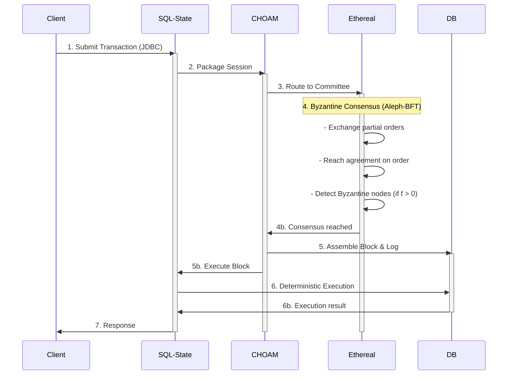

# End-to-End Transaction Flow Guide

**Understanding how transactions flow through the Delos distributed consensus system**

**Audience**: Application developers building on Delos
**Prerequisite**: Read [DEPLOYMENT_GUIDE.md](DEPLOYMENT_GUIDE.md) and [CHOAM README](../choam/README.md)
**Length**: ~700 lines

---

## Overview

This guide traces a single transaction through the Delos stack, from client submission to replicated state machine execution to response back to the client. Understanding this flow is essential for:

- Debugging transactions in production
- Understanding latency characteristics
- Diagnosing Byzantine faults
- Building monitoring and alerting
- Designing application logic

**TL;DR**: Transaction → SQL-State Session → CHOAM → Ethereal (BFT consensus) → Block assembly → SQL-State execution → Response

---

## Transaction Lifecycle: 7 Stages

### Stage 1: Client Submission (Application Layer)

The transaction originates from client code making changes to replicated state.

```java
// Client code: Standard JDBC
try (Connection conn = dataSource.getConnection();
     Statement stmt = conn.createStatement()) {

    // This is a regular SQL update
    stmt.executeUpdate("INSERT INTO users (name, email) VALUES ('Alice', 'alice@example.com')");
    // JDBC connection is to a local SqlStateMachine instance
}
catch (SQLException e) {
    // Transaction rejected or failed
    log.error("Transaction failed", e);
}
```

**What's happening:**
- Client code uses standard JDBC API (Connection, Statement, ResultSet)
- SQL statement is captured by local SqlStateMachine (not sent to database)
- SQL is queued for consensus submission
- Client waits for consensus result

**Key Classes:**
- `java.sql.Connection` - Standard JDBC interface
- `SqlStateMachine` (sql-state module) - Local replica

**Metrics** (monitored):
- `sql_state_transactions_submitted` - Total submissions
- `sql_state_transaction_latency` - Submission latency
- `sql_state_queue_depth` - Pending transactions

**Logs to expect:**
```
[DEBUG] sql-state: Transaction submitted: INSERT INTO users...
[DEBUG] sql-state: Waiting for consensus...
```

---

### Stage 2: Session Packaging (SQL-State Layer)

The SQL transaction is packaged into a session object for CHOAM (consensus) routing.

```java
// Internal: sql-state packaging (you don't call this directly)
// Triggered by SqlStateMachine.submitUpdate()

Session session = new Session(
    transactionId,           // Unique ID
    sqlStatement,            // "INSERT INTO users..."
    metadata,                // Timestamp, client info
    timestamp                // When it was submitted
);

// Package for transmission
byte[] sessionBytes = session.serialize();
```

**What's happening:**
- SQL statement wrapped in Session object
- Session assigned unique transaction ID (UUID or digest-based)
- Timestamp recorded (used for clock skew tolerance)
- Session serialized for transmission

**Key Classes:**
- `Session` (choam module) - Transaction container
- `TransactionId` (choam module) - Unique identifier

**Duration**: < 1ms typically

**Metrics:**
- `choam_sessions_created` - Total sessions created
- `choam_session_size_bytes` - Average session size

**Logs:**
```
[DEBUG] choam: Session created: txn-12345, size=256 bytes
[DEBUG] choam: Routing to committee...
```

---

### Stage 3: Committee Routing (CHOAM Layer)

The packaged session is routed to a committee of nodes for consensus.

```java
// Internal: CHOAM routing (called by Session.submit())

// Determine committee members (usually all N nodes)
List<Member> committee = getCommittee();  // Usually 7 nodes

// Submit to all committee members
for (Member member : committee) {
    submitToMember(member, session);
}

// Track submission
Submitter submitter = committee.createSubmitter();
submitter.submit(session);  // Fire-and-forget to all replicas
```

**What's happening:**
- Committee determined (usually all nodes in cluster)
- Session transmitted to all committee members via GRPC
- Each replica receives and queues the session
- Submitter tracks acceptance status

**Key Classes:**
- `Submitter` (choam module) - Routes to committee
- `Member` (memberships module) - Committee member
- `Committee` (choam module) - Committee abstraction

**Network**: Session transmitted to all N nodes
- **Throughput**: Limited by network (session size × N)
- **Latency**: Network round-trip time

**Metrics:**
- `choam_committee_submissions` - Total submissions to committee
- `choam_transmission_bytes` - Bytes sent to all replicas
- `grpc_requests_total` - GRPC call count

**Logs** (per replica):
```
[DEBUG] choam: Session received from client: txn-12345
[DEBUG] choam: Session queued for consensus: session-queue-depth=42
```

---

### Stage 4: Byzantine Consensus (Ethereal Layer)

All committee members run Aleph-BFT consensus to order the session into a block.

```java
// Internal: Ethereal consensus (automatic, transparent)
// Run on each committee member

ethereal.multicast(session);  // Multicast to all replicas

// Each replica participates in Aleph-BFT
// - Exchange partial orders (DAG)
// - Reach consensus on transaction order
// - Assemble block with canonical order
```

**What's happening:**
- All nodes exchange their submitted transactions
- Aleph-BFT orders transactions deterministically
- Byzantine nodes sending conflicting information are detected
- If f ≤ (n-1)/3: consensus reached despite Byzantine nodes
- Block assembled with canonical transaction order

**Key Properties:**
- **Safety**: All correct nodes agree on same order
- **Liveness**: Block finalized in finite time (usually 3-5 rounds)
- **Byzantine tolerance**: Up to f = ⌊(n-1)/3⌋ Byzantine nodes

**Key Classes:**
- `Ethereal` (ethereal module) - Consensus protocol
- `Aleph` - Implementation of Aleph-BFT algorithm

**Duration**:
- Happy path: 100-500ms (network dependent)
- View change: 1-2 seconds (Byzantine detection)

**Metrics:**
- `ethereal_consensus_rounds` - Rounds completed
- `ethereal_consensus_latency` - Time to finalize block
- `ethereal_byzantine_nodes_detected` - Byzantine replicas identified
- `ethereal_view_changes` - View changes during consensus

**Logs** (per replica):
```
[INFO] ethereal: Round 1: Received 7/7 partial orders
[DEBUG] ethereal: DAG assembly: 42 transactions ordered
[INFO] ethereal: Consensus reached on block #12345, 42 transactions
[WARN] ethereal: Byzantine node detected: node-3, excluding from round 2
```

---

### Stage 5: Block Assembly (CHOAM Layer)

After consensus, replicas assemble the ordered transactions into a block.

```java
// Internal: Block assembly (after Ethereal consensus)
// Run on each replica independently (deterministic)

Block block = Block.newBuilder()
    .setBlockNumber(height++)
    .setHeight(height)
    .setTimestamp(System.currentTimeMillis())
    .addAllSessions(consensusOrderedSessions)  // In consensus order
    .build();

// Write to append-only CHOAM log
choamLog.append(block);

// Trigger SQL-State execution
sqlState.executeBlock(block);
```

**What's happening:**
- Sessions ordered by consensus are assembled into block
- Block is immutable record of transactions
- Block appended to CHOAM log (append-only log)
- Log entry is durable (survives crashes)
- Block passed to SQL-State for execution

**Key Classes:**
- `Block` (choam module) - Block of ordered transactions
- `Log` (choam module) - Append-only transaction log
- `Checkpoint` (choam module) - Periodic snapshots

**Duration**: < 10ms (local operation)

**Metrics:**
- `choam_blocks_appended` - Total blocks written
- `choam_log_height` - Current log height
- `choam_block_size` - Average transactions per block
- `choam_log_bytes` - Total log size

**Logs**:
```
[DEBUG] choam: Assembling block #12345 from 42 consensused sessions
[INFO] choam: Block appended to log, height=12345, txn_count=42
[DEBUG] choam: Triggering SQL-State execution
```

---

### Stage 6: Deterministic Execution (SQL-State Layer)

Each replica executes the block's transactions in consensus order, producing identical state.

```java
// Internal: Deterministic execution (automatic)
// Run on each replica independently with same input → same output

for (Session session : block.getSessions()) {
    // Execute in consensus order
    String sqlStatement = session.getSql();

    try {
        // Execute SQL (deterministic: same input → same output)
        result = executeSQL(sqlStatement);

        // Log result for audit trail
        auditLog.record(session.getId(), result);

    } catch (Exception e) {
        // On error: all replicas see same error (deterministic)
        auditLog.recordError(session.getId(), e);
    }
}

// All replicas now have identical state (determined by consensus)
```

**What's happening:**
- Each replica independently executes all sessions from the block
- Execution is deterministic: same input (block) → same output (state)
- SQL statements are idempotent (replaying same block gives same result)
- State is replicated across all correct nodes
- All nodes reach identical state without comparing state

**Critical Property: Determinism**
- Timestamps use consensus time (not local time)
- Randomness seeded from consensus hash
- Database operations are deterministic
- No network I/O during execution

**Key Classes:**
- `SqlStateMachine` (sql-state module) - Executes block
- `H2` database - Deterministic SQL engine
- `Jooq` - Object/relational mapping

**Duration**: Variable by workload
- Simple INSERT: < 1ms
- Complex JOIN: 10-100ms
- Bulk load: seconds

**Metrics:**
- `sql_state_execution_latency` - Per-transaction execution time
- `sql_state_rows_modified` - Rows changed
- `sql_state_storage_bytes` - Database size

**Logs**:
```
[DEBUG] sql-state: Executing block #12345
[DEBUG] sql-state: txn-12345: INSERT INTO users VALUES (...)
[DEBUG] sql-state: txn-12346: UPDATE products SET count=42 WHERE id=7
[INFO] sql-state: Block #12345 executed: 42 transactions, 127 rows modified
```

---

### Stage 7: Response to Client (SQL-State Layer)

The client receives the result of the transaction.

```java
// Client code (continuing from Stage 1)
try (Connection conn = dataSource.getConnection();
     Statement stmt = conn.createStatement()) {

    stmt.executeUpdate("INSERT INTO users (name, email) VALUES (...)");

    // JDBC driver returns update count
    // (Network latency + consensus latency + execution latency)
}
catch (SQLException e) {
    // If any stage failed, exception is thrown here
}

// Total latency from submission to response:
// = Network (stage 3) + Consensus (stage 4) + Execution (stage 6)
// = Network + Byzantine rounds + SQL execution
// = Typically 100-500ms for happy path
```

**What's happening:**
- SQL result (row count, errors) prepared for client
- Response transmitted back to client via JDBC
- Client continues execution
- Transaction is committed and durable (on all correct replicas)

**Key Properties:**
- **Committed**: Durable on all correct replicas
- **Distributed**: Replicated across f+1 to n replicas
- **Resilient**: Survives up to f Byzantine nodes

**Duration**: Network round-trip

**Metrics:**
- `sql_state_response_latency` - End-to-end from submission to response
- `sql_state_transactions_completed` - Total completed
- `sql_state_transactions_failed` - Errors

**Logs**:
```
[DEBUG] sql-state: Sending result to client: 1 row inserted
[INFO] sql-state: Transaction committed: txn-12345, total_latency=234ms
```

---

## Complete Flow Sequence Diagram



---

## Latency Breakdown (Typical 7-Node Cluster)

| Stage | Duration | Factor |
|-------|----------|--------|
| 1. Submission | ~1ms | JDBC overhead |
| 2. Session packaging | <1ms | Local |
| 3. Committee routing | 10-50ms | Network RTT to all nodes |
| 4. Byzantine consensus | 100-400ms | Multiple rounds + Byzantine detection |
| 5. Block assembly | <10ms | Local |
| 6. SQL execution | 5-50ms | Workload dependent |
| 7. Response | 5-20ms | Network back to client |
| **Total** | **121-511ms** | P50 ≈ 250ms |

**P95 latency**: 500-1000ms (includes view changes, retransmissions)
**P99 latency**: 1-5 seconds (Byzantine recovery)

**Factors affecting latency:**
- **Network latency**: Dominant factor (stage 3 + 4)
- **Byzantine nodes**: Increases consensus rounds (stage 4)
- **Workload**: SQL execution time (stage 6)
- **Cluster size N**: Increases routing time (stage 3, 4)

---

## Happy Path vs Byzantine Scenarios

### Happy Path: All Nodes Correct

```
Client → SQL-State → CHOAM → Ethereal (1-2 rounds) → Execute → Response
Latency: ~250ms (network-dominated)
```

**Logs** (clean consensus):
```
[INFO] ethereal: Consensus reached in round 1
[INFO] choam: Block appended
[INFO] sql-state: Transaction committed
```

### Byzantine Node Detected (f=1, n=7)

```
Client → SQL-State → CHOAM → Ethereal
  → [Round 1: Detect Byzantine node]
  → [Round 2: Exclude Byzantine, reach consensus]
  → Execute → Response
Latency: ~800ms (additional round)
```

**Logs** (Byzantine detection):
```
[WARN] ethereal: Round 1: Node-3 sent conflicting proposal
[WARN] ethereal: Byzantine node detected: node-3
[INFO] ethereal: Round 2: Excluding node-3, consensus reached (6/7)
[INFO] choam: Block appended
```

### Partition/Network Issue

```
Client → SQL-State → CHOAM → Ethereal
  → [No consensus after 10 seconds]
  → [View change triggered]
  → [New coordinator elected]
  → Consensus → Execute → Response
Latency: 10+ seconds (view change overhead)
```

**Logs** (partition):
```
[WARN] ethereal: Round 1-3: Timeout waiting for proposals
[WARN] ethereal: View change triggered (timeout)
[INFO] ethereal: New view: coordinator=node-2
[INFO] ethereal: Consensus reached in new view
```

---

## Debugging Transactions in Logs

### How to trace a transaction through the cluster

**Step 1: Get transaction ID from JDBC**
```java
// Add logging to your JDBC code
try (Connection conn = dataSource.getConnection();
     Statement stmt = conn.createStatement()) {

    // Enable JDBC logging
    stmt.executeUpdate("... your SQL ...");

    // Check ResultSet for transaction ID
    // (Add custom tracing if needed)
}
```

**Step 2: Search logs for transaction ID**
```bash
# On each node, search for transaction ID
grep "txn-12345" /opt/delos/logs/delos.log

# You should see progression through stages:
# 1. [DEBUG] sql-state: Transaction submitted
# 2. [DEBUG] choam: Session created
# 3. [DEBUG] choam: Session received from client
# 4. [INFO] ethereal: Consensus reached
# 5. [INFO] choam: Block appended
# 6. [DEBUG] sql-state: Executing transaction
# 7. [INFO] sql-state: Transaction committed
```

**Step 3: Identify latency bottleneck**
```bash
# Extract timestamps from logs
grep "txn-12345" /opt/delos/logs/delos.log | \
    awk '{print $1, $2, $8}'  # Timestamp, level, message

# Compare timestamps between stages to identify bottleneck:
# - Large gap between submission and consensus = Network latency
# - Large gap in consensus = Byzantine detection or view change
# - Large gap in execution = Slow SQL or lock contention
```

### Common Log Patterns

**Normal transaction (happy path):**
```
2026-01-09 10:15:23.001 [INFO] sql-state: Transaction submitted: txn-12345
2026-01-09 10:15:23.002 [DEBUG] choam: Session created: 256 bytes
2026-01-09 10:15:23.010 [DEBUG] choam: Session routed to 7 nodes
2026-01-09 10:15:23.200 [INFO] ethereal: Consensus reached
2026-01-09 10:15:23.201 [INFO] choam: Block #12345 appended, 42 txns
2026-01-09 10:15:23.210 [DEBUG] sql-state: Executing txn-12345
2026-01-09 10:15:23.215 [INFO] sql-state: Transaction committed
→ Total latency: 214ms
```

**Byzantine detection (slow):**
```
2026-01-09 10:15:23.001 [INFO] sql-state: Transaction submitted: txn-12346
2026-01-09 10:15:23.100 [WARN] ethereal: Round 1: Node-3 conflicting
2026-01-09 10:15:23.200 [WARN] ethereal: Byzantine detected: node-3
2026-01-09 10:15:23.400 [INFO] ethereal: Consensus reached (round 2)
2026-01-09 10:15:23.401 [INFO] choam: Block appended
2026-01-09 10:15:23.410 [INFO] sql-state: Transaction committed
→ Total latency: 409ms (100-200ms extra for Byzantine handling)
```

**Network partition (very slow):**
```
2026-01-09 10:15:23.001 [INFO] sql-state: Transaction submitted: txn-12347
2026-01-09 10:15:25.000 [WARN] ethereal: Timeout in consensus (round 1)
2026-01-09 10:15:25.100 [WARN] ethereal: View change triggered
2026-01-09 10:15:26.000 [INFO] ethereal: New view elected
2026-01-09 10:15:26.200 [INFO] ethereal: Consensus reached
2026-01-09 10:15:26.201 [INFO] choam: Block appended
2026-01-09 10:15:26.210 [INFO] sql-state: Transaction committed
→ Total latency: 3209ms (3+ seconds due to view change)
```

---

## Key Metrics to Monitor

### Per-Transaction Metrics

| Metric | Meaning | Healthy Range | Alert Threshold |
|--------|---------|----------------|-----------------|
| `sql_state_response_latency_p50` | Median latency | 100-300ms | > 1000ms |
| `sql_state_response_latency_p95` | 95th percentile | 300-800ms | > 5000ms |
| `sql_state_response_latency_p99` | 99th percentile | 500-2000ms | > 10000ms |
| `ethereal_consensus_latency` | Time to consensus | 50-400ms | > 5000ms |
| `sql_state_transactions_failed` | Errors | 0 | > 0 |

### Cluster Health Metrics

| Metric | Meaning | Healthy | Alert |
|--------|---------|---------|-------|
| `ethereal_view_changes` | Byzantine detection | 0-1/min | > 5/min |
| `ethereal_consensus_rounds` | Normal = 1-2 | 1-2 | > 5 |
| `ethereal_byzantine_nodes_detected` | Expected f=1 | f | > f |
| `choam_blocks_appended` | Throughput | > 100/sec | < 10/sec |
| `choam_log_height` | Progress | Increasing | Stuck |

---

## Common Issues & Diagnosis

### Issue 1: High Latency (> 1 second)

**Symptoms:**
```
sql_state_response_latency_p50 > 1000ms
```

**Root Causes:**
1. **Network latency** - RTT between nodes > 100ms
   - Check: `ethereal_consensus_latency` high
   - Fix: Reduce network latency or cluster spread

2. **Byzantine detection** - Repeated view changes
   - Check: `ethereal_view_changes` > 0
   - Check: `ethereal_byzantine_nodes_detected` = 1+
   - Fix: Restart suspected Byzantine node

3. **SQL execution slow** - Workload bottleneck
   - Check: `sql_state_execution_latency` high
   - Check: Database locks, missing indexes
   - Fix: Optimize SQL queries, add indexes

**Diagnosis Steps:**
```bash
# 1. Check consensus latency
curl -s http://localhost:8080/metrics | grep ethereal_consensus_latency

# 2. Check for Byzantine detection
curl -s http://localhost:8080/metrics | grep byzantine_nodes

# 3. Check SQL execution time
curl -s http://localhost:8080/metrics | grep sql_state_execution

# 4. Check network latency between nodes
for node in node1 node2 node3; do
  ping -c 3 $node | tail -1
done
```

### Issue 2: Failed Transactions

**Symptoms:**
```
sql_state_transactions_failed > 0
```

**Root Causes:**
1. **Byzantine node rejecting transactions**
   - Check logs for Byzantine signatures
   - Check consensus failures

2. **SQL errors** (constraint violations, deadlocks)
   - Check SQL-State logs for specific errors
   - Review application logic

3. **Network issues** (transaction lost)
   - Check CHOAM logs for dropped sessions
   - Check network connectivity

**Diagnosis:**
```bash
# Search logs for transaction errors
grep "Transaction failed" /opt/delos/logs/delos.log | tail -10

# Check if error is SQL-related
grep "SQLException" /opt/delos/logs/delos.log

# Check if error is consensus-related
grep "consensus.*failed" /opt/delos/logs/delos.log
```

### Issue 3: Consensus Not Reaching Agreement

**Symptoms:**
```
ethereal_view_changes high (> 5/min)
ethereal_consensus_latency very high (> 30s)
No blocks appended (choam_blocks_appended stuck)
```

**Root Causes:**
1. **Byzantine node misbehaving** (systematic failures)
2. **Network partition** (subset of nodes isolated)
3. **Clock skew** (timestamps too different)

**Diagnosis:**
```bash
# Check for Byzantine detection
curl -s http://localhost:8080/metrics | grep byzantine_nodes

# Check for consensus rounds (should be 1-2, not 10+)
curl -s http://localhost:8080/metrics | grep consensus_rounds

# Check clock skew across nodes
for node in node1 node2 node3; do
  ssh delos@$node "date +%s.%N"
done
# Skew > 1 second is concerning
```

---

## Testing & Verification

### Unit Test: Verify Transaction Flow

```java
@Test
public void testTransactionFlowThroughConsensus() throws Exception {
    // 1. Create 3-node test cluster (f=1 Byzantine tolerance)
    TestCluster cluster = TestCluster.create(3);
    cluster.start();

    // 2. Submit transaction to node 1
    try (Connection conn = cluster.getConnection(0);
         Statement stmt = conn.createStatement()) {
        stmt.executeUpdate("INSERT INTO test_table VALUES (1, 'test')");
    }

    // 3. Verify consensus reached (block appended)
    cluster.waitForConsensus(Duration.ofSeconds(5));

    // 4. Verify all replicas have same state
    for (int i = 0; i < 3; i++) {
        try (Connection conn = cluster.getConnection(i);
             Statement stmt = conn.createStatement();
             ResultSet rs = stmt.executeQuery("SELECT COUNT(*) FROM test_table")) {
            rs.next();
            assertEquals(1, rs.getInt(1), "All replicas should have 1 row");
        }
    }
}
```

### Integration Test: Byzantine Node

```java
@Test
public void testByzantineNodeDetection() throws Exception {
    // 1. Create 7-node cluster (f=2)
    TestCluster cluster = TestCluster.create(7);

    // 2. Make node 3 Byzantine
    cluster.makeByzantine(2);  // Index 2 = node 3

    // 3. Submit transactions
    submitMultipleTransactions(cluster, 10);

    // 4. Verify Byzantine detection occurred
    long byzantineDetections = cluster.getMetric("ethereal_byzantine_nodes_detected");
    assertTrue(byzantineDetections > 0, "Byzantine node should be detected");

    // 5. Verify other nodes reached consensus (6/7 sufficient)
    long consensusReached = cluster.getMetric("ethereal_consensus_rounds_successful");
    assertEquals(10, consensusReached, "All transactions should reach consensus");
}
```

---

## Summary

Understanding the 7-stage transaction flow enables developers to:

1. **Predict latency**: Network + consensus + execution = ~250ms typical
2. **Debug issues**: Trace logs by transaction ID through each stage
3. **Design applications**: Understand Byzantine tolerance and resilience
4. **Monitor health**: Watch key metrics at each stage
5. **Diagnose failures**: Identify bottlenecks from latency breakdown

**Key Takeaways:**
- Transactions are consensus-ordered (stage 4 dominates latency)
- All replicas execute identically (determinism)
- Byzantine nodes are detected and excluded (view changes)
- State is replicated and durable (3+ replicas minimum)
- Failures are graceful (up to f Byzantine nodes tolerated)

---

Last Updated: 2026-01-09
Status: Phase 2.1 (Developer Enablement)
Epic: Delos-aj2 (Documentation Improvement)
