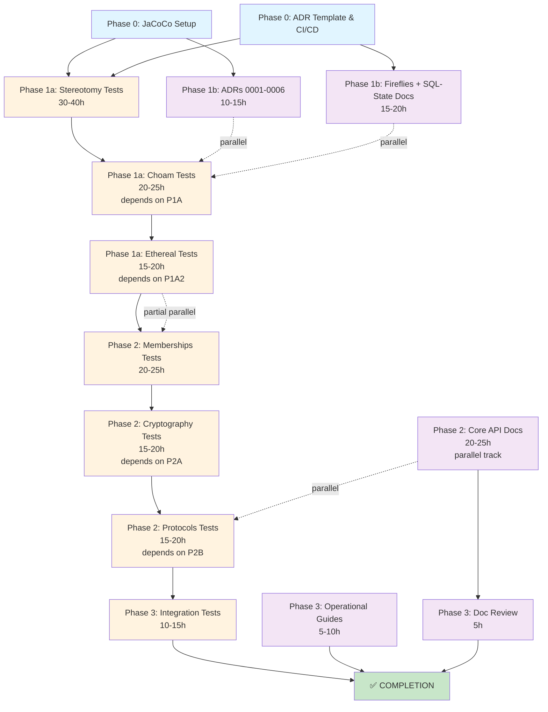

# ADR-0006: Quality Initiative Execution Strategy

**Status**: ACCEPTED

**Date**: 2026-01-06

**Context**

Delos has achieved significant maturity with Phase 0-3 fireflies remediation (109 issues resolved, Byzantine fault tolerance production-ready). However, the project faces critical gaps in testing coverage and documentation across core modules (stereotomy, choam, ethereal) that must be addressed before declaring production readiness.

The Quality Initiative must execute two concurrent work streams (testing and documentation) while respecting critical dependency constraints: stereotomy forms the cryptographic foundation for choam, which forms the consensus foundation for ethereal. Testing and documentation must follow this layered architecture to avoid circular dependencies.

This ADR documents the phased execution strategy, dependency analysis, and parallelization approach for achieving production-grade quality across all Delos components.

**Decision**

**We adopt a phased execution strategy with parallel work streams, ordered by architectural dependencies:**

**Two Concurrent Work Streams**:
1. **Delos-6v5 (Testing)**: Add missing unit tests for 95%+ critical path coverage on stereotomy, choam, ethereal
2. **Delos-pb1 (Documentation)**: Create ADRs, API documentation, usage examples, operational guides

**Four Execution Phases** (6-8 weeks total):

### Phase 0: Setup and Baseline (2 weeks)
- **Delos-6v5 tasks**:
  - Configure JaCoCo plugin (Maven, Surefire integration, exclusions)
  - Create test fixtures and harnesses (KeyMaterial, Identity, Byzantine scenario builders)
  - Establish baseline coverage measurements

- **Delos-pb1 tasks**:
  - Create ADR template and infrastructure (docs/adr/0000-MADR.md)
  - Configure Javadoc plugin (Java 25 release, UTF-8 encoding)
  - Create GitHub Actions CI/CD workflow (coverage reporting, PR comments)

- **Parallelization**: 100% independent; both tracks run in parallel
- **Synchronization Point**: None (independent infrastructure)
- **Critical Decision**: JaCoCo 0.8.13+ required for Java 25 (defer Phase 1a until Q1/Q2 2026)

### Phase 1: Foundation (3-4 weeks)
#### Phase 1a: Critical Testing (stereotomy, choam, ethereal)
- **Stereotomy** (30-40 hours, P0-CRITICAL):
  - KeyState immutability tests
  - KeyEventProcessor authentication (4-step validation)
  - Inception event signature handling
  - Key rotation with witness threshold
  - KERL concurrency and transaction boundaries
  - Key material security (clearing, exposure prevention)
  - Target: 95%+ line coverage critical path

- **Choam** (20-25 hours, P0-CRITICAL):
  - Committee selection via bftSubset
  - Block ordering and consensus
  - View reconfiguration protocol
  - Byzantine failure scenarios
  - Checkpoint creation and restoration
  - Ephemeral key management
  - Target: 95%+ line coverage critical path

- **Ethereal** (15-20 hours, P0-CRITICAL):
  - DAG construction and validation
  - BFT quorum mechanisms
  - Consensus liveness properties
  - Byzantine peer handling
  - Dag.validate() correctness for f < n/3
  - Target: 95%+ line coverage critical path

- **Parallelization**: SEQUENTIAL by architecture
  - Stereotomy tests first (foundation)
  - Choam tests second (depends on stereotomy fixtures)
  - Ethereal tests third (depends on choam consensus)
  - Justification: Cannot mock these layers effectively; circular dependencies prevent parallelization
  - Estimated duration: 3-4 weeks (sequential)

#### Phase 1b: Foundation Documentation
- **ADRs 0001-0006** (10-15 hours):
  - ADR-0001: JaCoCo baseline deferral decision
  - ADR-0002: KERI Implementation (Stereotomy)
  - ADR-0003: BFT Membership (Fireflies)
  - ADR-0004: Consensus Design (Choam)
  - ADR-0005: Deterministic SQL (sql-state)
  - ADR-0006: Execution Strategy (this ADR)

- **Production API Documentation** (15-20 hours):
  - Fireflies: Javadoc, 3-5 usage examples, performance tuning guide
  - SQL-State: JDBC contracts, workflow examples, operational guide
  - Tron: FSM tutorial, design pattern documentation, performance characteristics

- **Parallelization**: 80%+ parallel with Phase 1a
  - ADR creation independent from testing
  - Production documentation independent from testing (examples reference README only)
  - Only synchronization: Ensure API docs align with 80%+ test coverage achieved in 1a
  - Estimated duration: 3-4 weeks (parallel)

### Phase 2: Extended Coverage (2-3 weeks)
- **Memberships testing** (20-25 hours):
  - Ring structure and BFT ordering
  - Context and Member abstractions
  - Gossip protocol variants
  - Depends on: stereotomy tests completed

- **Cryptography testing** (15-20 hours):
  - Digest algorithms and verification
  - Signature generation and verification
  - HexBloom construction and verification
  - Depends on: memberships tests for context integration

- **Protocols testing** (15-20 hours):
  - GRPC lifecycle and failure handling
  - Rate limiters and backpressure
  - Message serialization
  - Depends on: cryptography tests completed

- **Core API documentation** (20-25 hours):
  - Fireflies extended examples
  - Choam usage patterns
  - Integration guides
  - Depends on: Phase 1b ADRs completed

- **Parallelization**: Partial parallelization of memberships + cryptography + protocols
  - Can start memberships while ethereal tests in final review (80% overlap)
  - API docs and memberships tests can run in parallel
  - Estimated duration: 2-3 weeks

### Phase 3: Integration and Validation (1-2 weeks)
- **Integration tests** (10-15 hours):
  - End-to-end scenarios combining layers
  - Stress testing with all modules together
  - Bootstrap and recovery validation
  - Depends on: Phase 2 extended coverage completed

- **Operational Guides** (5-10 hours):
  - Deployment guide (multi-node setup, MTLS, KERI identity provisioning)
  - Monitoring guide (Dropwizard metrics, health checks, performance baselines)
  - Troubleshooting guide (common issues, log interpretation, recovery procedures)

- **Documentation Review and Optimization** (5 hours):
  - Cross-reference validation
  - Example code verification
  - Link integrity checking
  - Depends on: All ADRs and API docs completed

- **Parallelization**: Full parallelization of operational guides + documentation review
  - Estimated duration: 1-2 weeks

## Dependency Graph

**Legend**:
- Blue: Phase 0 (Infrastructure)
- Orange: Testing (1a, 2a, 3a) - SEQUENTIAL by architecture
- Purple: Documentation (1b, 2d, 3b/c) - INDEPENDENT, PARALLEL
- Solid arrows: Blocking dependencies (must complete before)
- Dotted arrows: Parallel/non-blocking relationships

## Parallelization Analysis

**Phase 0: 100% Parallel**
- JaCoCo setup and ADR infrastructure are independent
- Both complete in ~2 weeks

**Phase 1: 75% Parallel**
- Testing (1a) runs SEQUENTIALLY (stereotomy → choam → ethereal)
- Documentation (1b) runs INDEPENDENTLY (ADRs, fireflies docs, sql-state docs)
- Synchronization: Ensure API docs reflect tested interfaces (not blocking)
- Net time: 3-4 weeks (dominated by longest test sequence)

**Phase 2: 60% Parallel**
- Memberships/Cryptography/Protocols tests run SEQUENTIALLY (deps)
- API docs and extended examples run in PARALLEL
- Can start memberships while ethereal final review (80% overlap)
- Net time: 2-3 weeks

**Phase 3: 80% Parallel**
- Integration tests, operational guides, and documentation review all PARALLEL
- Net time: 1-2 weeks

## Critical Dependencies (Cannot Parallelize)

| Dependency | Reason | Impact |
|-----------|--------|--------|
| stereotomy → choam | Choam uses Stereotomy for ephemeral key generation | 100% blocking |
| choam → ethereal | Ethereal tests need choam consensus fixtures | 100% blocking |
| memberships → cryptography | Cryptography used in gossip validation | Partial blocking |
| cryptography → protocols | GRPC uses digest/signature verification | Partial blocking |

## Blocking Constraints

1. **Stereotomy Tests Must Complete First**
   - MemKERLFixtures needed for choam testing
   - Cannot mock KERI authentication layer
   - Estimated duration: 30-40 hours

2. **Choam Tests Must Complete Before Ethereal**
   - Committee selection depends on choam correctness
   - Cannot mock consensus layer
   - Estimated duration: 20-25 hours

3. **JaCoCo 0.8.13+ Must Be Released (for Java 25)**
   - Phase 1a testing blocked until JaCoCo 0.8.13
   - Expected: Q1/Q2 2026
   - Mitigation: Phase 1b documentation can proceed immediately

## Effort Estimates and Timeline

| Phase | Duration | Testing (1a) | Documentation (1b) | Overlaps |
|-------|----------|--------------|-------------------|----------|
| Phase 0 | 2 weeks | 10h | 10h | 100% |
| Phase 1 | 3-4 weeks | 65-85h | 25-35h | 75% |
| Phase 2 | 2-3 weeks | 50-65h | 20-25h | 60% |
| Phase 3 | 1-2 weeks | 10-15h | 10-15h | 80% |
| **TOTAL** | **6-8 weeks** | **135-165h** | **65-85h** | **~70% avg** |

## Team Allocation Recommendations

| Option | Setup | Duration | Notes |
|--------|-------|----------|-------|
| **Sequential** (1 dev) | All alone | 8-10 weeks | Baseline: 100% serial |
| **Parallel** (2 devs) | Split testing + docs | 4-5 weeks | Dev 1: testing, Dev 2: docs |
| **Hybrid** (1 dev + doc contractor) | 1 tech, 1 doc | 5-6 weeks | Balanced approach |
| **Recommended** | 1 developer | 6-8 weeks | Current plan; leverage testing order |

## Success Metrics

### Testing Metrics
- **Line Coverage**: 95%+ critical modules, 85%+ extended
- **Branch Coverage**: 90%+ critical, 80%+ extended
- **Test Count**: ~150-200 new tests added
- **Test Ratio**: Improve from 16-45% to 80%+
- **Flakiness**: <1% failure rate
- **Duration**: All tests complete in <10 minutes

### Documentation Metrics
- **ADRs**: 15+ created (0001-0015 planned)
- **API Coverage**: 100% public interfaces documented
- **Usage Examples**: 10+ complete workflows
- **Operational Guides**: 3 comprehensive guides
- **Cross-references**: All ADRs linked to code
- **Freshness**: All docs aligned with source code

## Risk Mitigation

| Risk | Probability | Mitigation |
|------|-------------|-----------|
| JaCoCo delay past Q2 2026 | LOW | Phase 1b proceeds independently |
| Testing identifies architectural issues | MEDIUM | Iterate with design; may adjust Phase 2 |
| Documentation scope creep | MEDIUM | Strict MADR format; examples only |
| Test infrastructure gaps | LOW | mu1 design complete; templates available |
| Timeline drift in Phase 1a | MEDIUM | Checkpoint after stereotomy; reassess choam |
| Parallel work conflicts | LOW | Different files; clear ownership |

## Decision Rationale

**Why Phase 0 First?**
- Infrastructure enables both work streams
- JaCoCo and CI/CD common to both
- ADR template enforces documentation standards

**Why Sequential Testing by Architecture?**
- Stereotomy is cryptographic foundation; cannot be mocked
- Choam depends on stereotomy for key management; cannot be mocked
- Ethereal depends on choam for consensus; cannot be mocked
- Circular dependency breaking requires execution order

**Why Parallel Documentation?**
- ADRs independent from testing progress
- API docs reference only public interfaces (not test coverage)
- Examples can be written against README/implementation
- Only synchronization: ensure docs reflect 80%+ tested paths

**Why JaCoCo Deferral?**
- Java 25 incompatibility with 0.8.12 (latest stable)
- Option 1 (Java 21 downgrade) introduces compilation variance
- Option 2 (wait for 0.8.13) gives clean baseline reflecting production bytecode
- Selected: Option 2 (deferred baseline, Phase 1b proceeds immediately)

## Integration Points

1. **Fireflies Results**: Phase 3 tests integrate with fireflies gossip/consensus
2. **Stereotomy Identity**: All modules validate signatures via KERI
3. **Choam Consensus**: ethereal tests build on choam consensus mechanisms
4. **SQL-State**: Tests verify CHOAM block processing into materialized view
5. **Tron FSM**: Choam driven by Tron state machines

## Next Actions

1. **Immediate**: Approve Phase 0 tasks and create sub-beads
2. **Week 1-2**: Execute Phase 0 (JaCoCo setup, ADR template, CI/CD)
3. **Week 3+**: Start Phase 1a (stereotomy tests) + Phase 1b (ADRs)
4. **Monitor**: JaCoCo release schedule; trigger Phase 1a when 0.8.13+ available
5. **Weekly**: Update EXECUTION_STATE.md with progress and blockers

---

**Decision Made By**: Quality Initiative Planning Team
**Last Updated**: 2026-01-06
**Status**: ACCEPTED - Ready for implementation with 6-8 week timeline

**Related Documents**:
- QUALITY_INITIATIVE_PLAN.md (detailed phase breakdown)
- EXECUTION_STATE.md (progress tracking)
- ADR-0001 through 0005 (individual decision records)
