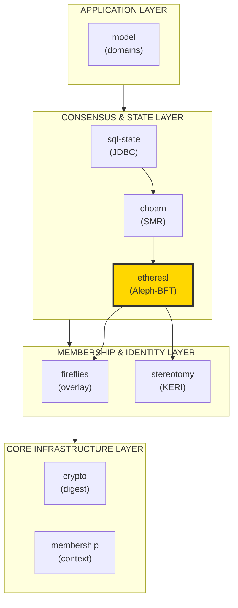
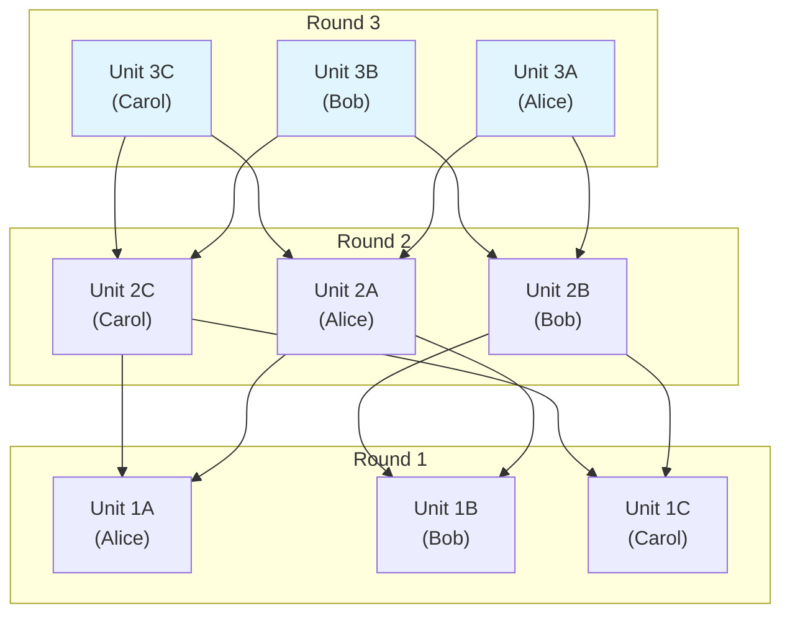
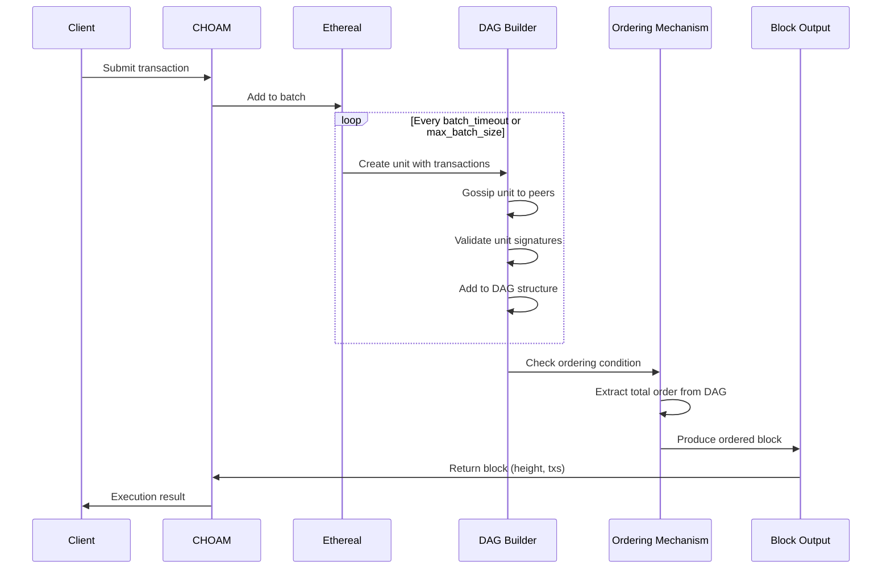
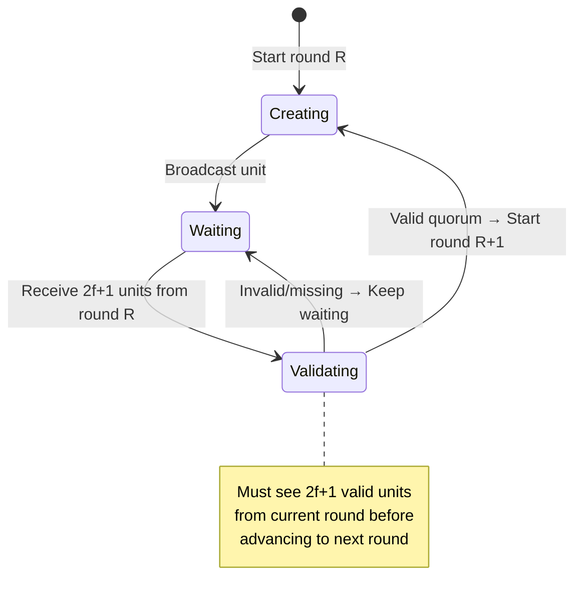
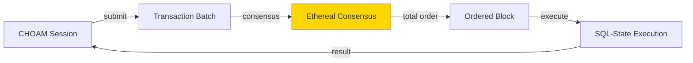

# Delos Ethereal

_Asynchronous Byzantine consensus that orders transactions into a totally ordered DAG without leader bottlenecks._

---

Delos Ethereal implements the Aleph-BFT protocol from the most excellent paper [Aleph: Efficient Atomic Broadcast in Asynchronous Networks with Byzantine Nodes](https://arxiv.org/abs/1908.05156). Ethereal provides asynchronous Byzantine fault-tolerant consensus for the Delos stack, enabling committees to agree on total transaction order without timing assumptions.

The Ethereal codebase is loosely based on the Aleph Zero Foundation's proof of concept code in Golang, [consensus-go](https://github.com/aleph-zero-foundation/consensus-go), adapted to Java 25 and integrated with Fireflies membership.

## Architecture Position



**Ethereal's role**: Receives transaction batches from CHOAM, produces totally ordered blocks via DAG-based consensus, returns ordered blocks to CHOAM for state machine execution.

## Design

### DAG-Based Consensus

Unlike leader-based BFT protocols (PBFT, Raft), Ethereal uses a Directed Acyclic Graph (DAG) structure where all members contribute units concurrently. This eliminates leader bottlenecks and provides optimal throughput.



**Key properties**:
- **Concurrent unit creation**: All members produce units simultaneously
- **DAG dependencies**: Units reference previous round units from 2/3+1 members
- **Total ordering**: Algorithm extracts linear order from DAG structure
- **No leader election**: Symmetric protocol without primary/backup distinction

### Consensus Flow



### Asynchronous Safety

Ethereal makes **no timing assumptions**. Consensus completes correctly even with:
- Arbitrary network delays
- Variable message delivery times
- Slow or failed members (up to f < n/3)
- Network partitions (temporary)

**Byzantine fault tolerance**: Requires 3f+1 members to tolerate f Byzantine (malicious) failures.

## Algorithm Overview

### Unit Structure

A **unit** is the fundamental building block:

```java
record Unit(
    long round,              // Monotonically increasing round number
    Member creator,          // Member that created this unit
    List<UnitHash> parents,  // References to 2/3+1 units from previous round
    List<Transaction> data,  // Transaction batch (can be empty)
    Signature signature      // Creator's signature over unit
) {}
```

**Validity requirements**:
1. `parents.size() >= 2f+1` (Byzantine quorum)
2. All parents from `round - 1`
3. Valid signature from creator
4. Creator has not produced another unit this round (no equivocation)

### Round Progression



**Round advancement**: Member advances from round R to R+1 only after seeing 2f+1 valid units from round R.

### Ordering Mechanism

Ethereal uses a **DAG-based ordering** algorithm:

1. **Common vote**: Members exchange votes on which units are "popular" (seen by 2/3+1 members)
2. **Timing rounds**: Special rounds where timing information is collected
3. **Coin flips**: Deterministic randomness breaks ties in ordering decisions
4. **Total order extraction**: Once ordering decided, extract linear sequence of transactions

**Guarantee**: All honest members extract the **same total order** from their local DAG views.

### Checkpointing

Periodically, Ethereal produces a **checkpoint** indicating consensus progress:
- **Height**: Monotonically increasing block number
- **State hash**: Digest of all ordered transactions up to this height
- **Safe to discard**: Old DAG units before checkpoint can be garbage collected

## Public API Reference

### Core Classes

#### `Ethereal` (Main Entry Point)

**Location**: `ethereal/src/main/java/com/hellblazer/delos/ethereal/Ethereal.java`

Main interface for consensus operations.

**Key Methods**:
- `start()` - Start consensus participant
- `stop()` - Stop consensus and cleanup
- `submit(batch: List<Transaction>): CompletableFuture<Block>` - Submit transaction batch for ordering
- `subscribe(consumer: Consumer<Block>)` - Subscribe to ordered blocks
- `currentHeight(): long` - Get current block height

**Properties**:
- **Thread-safe**: Concurrent submissions allowed
- **Asynchronous**: Returns futures for ordered results
- **Non-blocking**: Does not wait for consensus completion

#### `Unit` (Consensus Building Block)

**Location**: `ethereal/src/main/java/com/hellblazer/delos/ethereal/Unit.java`

Represents a single unit in the DAG.

**Key Methods**:
- `getRound(): long` - Get unit's round number
- `getCreator(): Member` - Get creating member
- `getParents(): List<UnitHash>` - Get parent unit references
- `getData(): List<Transaction>` - Get transaction batch
- `hash(): UnitHash` - Get content hash

**Validation**:
- Signature verification via Stereotomy
- Parent count >= 2f+1
- Round consistency checks

#### `Block` (Ordered Output)

**Location**: `ethereal/src/main/java/com/hellblazer/delos/ethereal/Block.java`

Totally ordered block produced by consensus.

**Key Fields**:
- `height: long` - Monotonically increasing sequence number
- `transactions: List<Transaction>` - Ordered transaction batch
- `previousHash: Digest` - Hash of previous block (chain structure)
- `hash: Digest` - Hash of this block

**Guarantees**:
- All honest members produce blocks with same height → same transactions → same hash
- Heights are contiguous (no gaps)

#### `PreUnit` (Pending Consensus Unit)

**Location**: `ethereal/src/main/java/com/hellblazer/delos/ethereal/PreUnit.java`

Unsigned unit before consensus completion.

**Usage**:
- Internal representation during DAG construction
- Converted to `Unit` after signature validation
- Used for gossip and validation

## Usage Examples

### 1. Start Ethereal Consensus

```java
// Prerequisites: Fireflies membership + KERI identity
Context<Member> context = fireflies.currentView().getContext();
ControlledIdentifier identifier = stereotomy.newIdentifier(params);

// Create Ethereal parameters
Parameters params = Parameters.newBuilder()
    .setN(7)              // Total members
    .setF(2)              // Byzantine tolerance (n = 3f+1)
    .setBatchSize(100)    // Max transactions per unit
    .setBatchTimeout(Duration.ofMillis(100))
    .build();

// Create and start Ethereal
Ethereal ethereal = new Ethereal(
    params,
    identifier,
    context,
    router,  // GRPC router
    metrics
);

ethereal.start();
```

### 2. Submit Transactions for Ordering

```java
// Create transaction batch
List<Transaction> batch = List.of(
    new Transaction(data1),
    new Transaction(data2),
    new Transaction(data3)
);

// Submit to consensus
CompletableFuture<Block> future = ethereal.submit(batch);

// Async handling
future.thenAccept(block -> {
    System.out.println("Ordered at height: " + block.height());
    System.out.println("Block hash: " + block.hash());
});

// Or blocking
Block block = future.get(10, TimeUnit.SECONDS);
```

### 3. Subscribe to Ordered Blocks

```java
// Process all ordered blocks as they arrive
ethereal.subscribe(block -> {
    System.out.println("Block " + block.height() + " ordered:");

    for (Transaction tx : block.transactions()) {
        processTransaction(tx);
    }

    // Update application state
    updateState(block);
});

// Blocks arrive in total order: height N before height N+1
// All members see same transactions at same height
```

### 4. Monitor Consensus Progress

```java
// Check current progress
long currentHeight = ethereal.currentHeight();
System.out.println("Consensus at height: " + currentHeight);

// Wait for specific height
CompletableFuture<Void> atHeight = ethereal.awaitHeight(100);
atHeight.thenRun(() -> {
    System.out.println("Reached height 100");
});

// Check DAG statistics
DagStats stats = ethereal.dagStatistics();
System.out.println("DAG units: " + stats.totalUnits());
System.out.println("Pending: " + stats.pendingUnits());
```

### 5. Handle View Changes (Reconfiguration)

```java
// Ethereal integrates with Fireflies for membership changes
fireflies.membership().changes().subscribe(newView -> {
    // Ethereal automatically adapts to new committee
    System.out.println("Consensus committee changed");
    System.out.println("New size: " + newView.getMembers().size());
});

// Consensus continues across view changes
// In-flight transactions are preserved
```

## Performance Characteristics

### Throughput
- **Optimal**: All members contribute units concurrently (no leader bottleneck)
- **Typical**: 10,000-50,000 transactions/second with 7 members
- **Bottleneck**: Network bandwidth and signature verification

### Latency
- **Consensus completion**: 3-5 rounds (typically 300-500ms with 100ms round time)
- **Ordering guarantee**: Once block produced, order is final and Byzantine-safe
- **Network dependent**: Varies with network latency and member count

### Scalability
- **Committee size**: Tested with 7-21 members
- **DAG memory**: O(n × rounds) where n = committee size
- **Garbage collection**: Old units pruned after checkpoint
- **Network**: O(n²) unit gossip (broadcast to all members)

### Resource Usage
- **CPU**: Signature verification dominates (Ed25519: ~50k ops/sec)
- **Memory**: ~100 MB for DAG state (typical workload, 7 members)
- **Network**: ~1-10 Mbps per member depending on transaction rate
- **Disk**: Minimal (only checkpoints persisted, not full DAG)

## Integration with CHOAM

Ethereal is tightly coupled with CHOAM for state machine replication:



**Workflow**:
1. **CHOAM batches** client transactions
2. **Ethereal orders** batches via DAG consensus
3. **Block emitted** with height and transaction list
4. **CHOAM executes** transactions deterministically
5. **State replicated** across all members

**Key property**: Ethereal guarantees total order, CHOAM guarantees deterministic execution → replicated state machines.

## Metrics

Ethereal exposes operational metrics via Dropwizard Metrics.

**Source**: `ethereal/src/main/java/com/hellblazer/delos/ethereal/EtherealMetrics.java`

### Consensus Progress (Gauge)

| Metric | Description | Healthy |
|--------|-------------|---------|
| `currentHeight()` | Latest ordered block height | Monotonically increasing |
| `currentRound()` | Current DAG construction round | Progresses steadily |
| `dagSize()` | Total units in DAG | Grows until checkpoint |

### Throughput (Meter)

| Metric | Description | Typical |
|--------|-------------|---------|
| `unitsCreated()` | Units created per second | ~10-100/sec |
| `blocksProduced()` | Blocks ordered per second | ~10-50/sec |
| `transactionsOrdered()` | Transactions ordered per second | 1,000-50,000/sec |

### Latency (Timer)

| Metric | Description | Healthy Range |
|--------|-------------|---------------|
| `unitCreationTime()` | Time to create unit | p95 < 10ms |
| `blockOrderingTime()` | Time from submission to ordering | p95 < 500ms |
| `signatureVerificationTime()` | Time to verify unit signature | p95 < 1ms |

### Network (Histogram)

| Metric | Description |
|--------|-------------|
| `inboundUnits()` | Units received via gossip |
| `outboundUnits()` | Units broadcast to peers |
| `unitGossipSize()` | Size of gossip messages |

### Resource (Gauge)

| Metric | Description | Alert Threshold |
|--------|-------------|-----------------|
| `dagMemoryUsage()` | Memory consumed by DAG | > 500 MB |
| `pendingTransactions()` | Transactions awaiting consensus | > 10,000 |
| `staleUnits()` | Units not yet ordered | > 1,000 |

## Testing and Validation

**Test Suite Location**: `ethereal/src/test/java/com/hellblazer/delos/ethereal/`

**Test Coverage**:
- **Functionality**: Unit creation, DAG construction, ordering extraction
- **Byzantine Behavior**: Equivocation, invalid signatures, malformed units
- **Network Conditions**: Delays, partitions, message loss
- **View Changes**: Committee reconfiguration during consensus
- **Checkpointing**: State pruning, recovery from checkpoint
- **Performance**: Throughput and latency under load

**Running Tests**:
```bash
# All ethereal tests
./mvnw test -pl ethereal

# Specific test class
./mvnw test -pl ethereal -Dtest=DagConstructionTest

# Performance tests
./mvnw test -pl ethereal -Dtest=PerformanceTest -Dlarge_tests=true
```

## Troubleshooting

### Consensus Stalls (No Blocks Produced)

**Symptoms**: `currentHeight()` not increasing

**Causes**:
1. **Insufficient members**: Need 2f+1 live members
2. **Network partition**: Members cannot communicate
3. **Byzantine members**: More than f malicious members

**Diagnosis**:
```bash
# Check member liveness
fireflies.currentView().thenAccept(view -> {
    System.out.println("Live members: " + view.getMembers().size());
    System.out.println("Failed: " + view.getFailed().size());
});

# Check DAG stats
DagStats stats = ethereal.dagStatistics();
System.out.println("Pending units: " + stats.pendingUnits());
```

**Resolution**:
- Ensure 2f+1 members alive
- Check network connectivity
- Review logs for Byzantine behavior

### High Latency (Slow Ordering)

**Symptoms**: `blockOrderingTime()` p95 > 1 second

**Causes**:
1. Network latency between members
2. Overloaded members (high CPU/memory)
3. Large transaction batches

**Diagnosis**:
```bash
# Check round progression
echo "Round time: $(ethereal.currentRound() / uptime_seconds)"

# Check batch sizes
echo "Batch size: $(ethereal.metrics.transactionsPerBlock().mean())"
```

**Resolution**:
- Reduce batch size or timeout
- Increase member resources
- Optimize network topology (lower latency paths)

### Memory Growth (DAG Not Pruning)

**Symptoms**: `dagMemoryUsage()` continuously increasing

**Causes**:
1. Checkpoint not triggering
2. Old units not garbage collected
3. Stale units accumulating

**Diagnosis**:
```bash
# Check checkpoint frequency
echo "Last checkpoint: $(ethereal.lastCheckpointHeight())"

# Check stale units
echo "Stale units: $(ethereal.metrics.staleUnits())"
```

**Resolution**:
- Increase checkpoint frequency
- Force manual checkpoint: `ethereal.checkpoint()`
- Restart member to clear DAG state

## References

### Papers
- **Aleph BFT**: [Efficient Atomic Broadcast in Asynchronous Networks with Byzantine Nodes](https://arxiv.org/abs/1908.05156)
- **DAG-based Consensus**: Foundation for Ethereal design
- **Byzantine Agreement**: Classic results on f < n/3 threshold

### Source Code
- **Main**: `ethereal/src/main/java/com/hellblazer/delos/ethereal/`
- **Tests**: `ethereal/src/test/java/com/hellblazer/delos/ethereal/`
- **Protobuf**: `grpc/src/main/proto/ethereal.proto`

### Integration Points
- **Fireflies**: Membership and secure overlay
- **CHOAM**: State machine replication layer
- **Stereotomy**: Signature creation and verification
- **Cryptography**: Hash functions and self-describing digests

### Related Modules
- **fireflies**: Byzantine membership (see `fireflies/README.md`)
- **choam**: Committee-based state machines (see `choam/README.md`)
- **sql-state**: JDBC-accessible replicated databases

---

**Status**: Production-ready as of January 2026. Ethereal provides asynchronous Byzantine consensus without leader bottlenecks, enabling high-throughput totally ordered transaction logs for Delos state machine replication.
