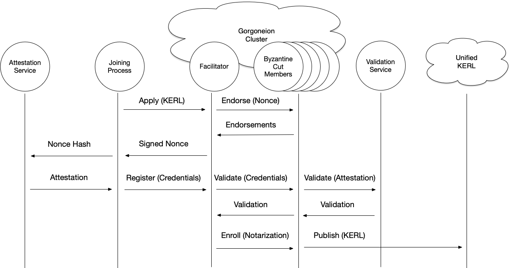

# Gorgoneion - Γοργόνειον

Delos identity bootstrapping and secrets service

## Decentralized Identity Bootstrapping

Gorgoneion is primarily concerned with the bootstrapping of process identity. Identity in Delos is Identifier based and
rooted off of the Key Event Receipt Infrastructure (KERI) architecture of the [Stereotomy](../stereotomy/README.md)
module.

Gorgoneion is designed to be general enough to integrate with any fundamental identity attestation service that one
might make use of in production settings. Thus, Gorgoneion provides a federation framework for bootstrapping identity
and trust across multiple infrastructure implementations, across regions and ultimately across disparate trust
boundaries (due to the use of KERI decentralized identity at the foundation of the service).

The service ultimately provides the mechanism for introducing self-sovereign (self-managed) identity into a trusted
realm so that these processes can interact in a secure fashion and be assured that the controller of an identifier (
ultimately, ownership of a private key) is who they claim they are.

## Attestation Protocol

Gorgoneion is the implementation of a protocol that transforms trusted attestation into trusted identifiers. The diagram
below illustrates the protocol interaction

### Protocol Sequence

1. The joining process sends its KERL over as the application to any member in the Gorgoneion cluster
2. Facilitating member generates a Nonce and then calculates the byzantine cut of the cluster membership
3. Byzantine cut members sign the generated Nonce, and the facilitating member gathers these signatures and returns the
   Signed Nonce to the joining member
4. The Joining member then calls the attestation service using the returned Nonce - either hashed, or whatever form the
   attestation service requires
5. A signed attestation is generated using the supplied Nonce information and returned to the joining member
6. The joining member generates the Signed Attestation from the attestation service's fundamental attestation, combines
   this with the signed nonce to create the Credential for enrollment
7. The joining member then sends the Credential to any member in the Gorgoneion cluster
8. This facilitating member then passes the Credential to the validating members (the original byzantine cut) for
   validation of the included attestation
9. Validating members of the byzantine cut call the attestation validation service (which may be local functionality,
   rather than a separate service).
10. When validated, the members return the KERI validation for the joining member's KERL
11. The facilitating member uses the gathered validations to create the Notarization — the combination of the
    joining member's KERL and Validations
12. The facilitating member sends the Notarization to the byzantine cut membership subset which then validates there is
    a majority of validations and then publishes the joining member's KERL and associated Validations to the destination
    Unified KERL

## Security Properties

### Byzantine Fault Tolerance

Gorgoneion provides Byzantine fault-tolerant identity admission through cryptographic validation and consensus:

- **BFT Model**: 3f+1 fault tolerance (tolerates up to f Byzantine failures in a cluster of 3f+1 members)
- **Quorum Requirements**:
  - Majority threshold: `⌈(n + f + 1) / 2⌉` where n = context size, f = max failures
  - Single-member contexts: majority = 1 (bootstrapping case)
  - Multi-member contexts: majority computed via `context.majority()`
- **Deterministic Subset**: BFT subset for each identifier computed deterministically using `context.bftSubset(digest(identifier))` ensuring all members agree on validators
- **Signature Verification**: Every signature (nonce endorsements, credential validations, notarizations) cryptographically verified using member's current KERL state keys
- **Liveness**: Admission succeeds if BFT subset has honest majority reachable within timeout

### Cryptographic Validation

All protocol messages are cryptographically protected:

- **KERL Chain Validation**:
  - Must start with InceptionEvent and end with EstablishmentEvent
  - Sequential signature verification using KeyEventProcessor
  - Sequence number monotonicity (exact increment by 1)
  - Digest chain integrity (priorEventDigest matches previous event hash)
  - Pre-rotation commitment validation
- **Nonce Endorsement**:
  - BFT subset members sign nonce with their KERL signing keys
  - Signatures verified against members' current key state
  - Requires BFT majority of valid signatures
- **Attestation Verification**:
  - External attestation signature verified using configurable verifier predicate
  - Supports AWS, GCP, Azure, SGX/TPM attestation mechanisms
  - Attestation must sign the nonce (binding attestation to this admission session)
- **Validation Signatures**:
  - Each BFT member signs the inception event
  - Signatures verified using validator's establishment keys from KERL
  - Only validators in expected BFT subset accepted

### Freshness Requirements

Time-based defenses against replay and stale credential attacks:

- **Nonce Timestamp Validity Window**:
  - Valid if: `now - maxDuration ≤ timestamp ≤ now + clockSkewTolerance`
  - Default: `maxDuration = 30 seconds` (past tolerance)
  - Default: `clockSkewTolerance = 5 seconds` (future tolerance)
  - Prevents replay of old nonces and acceptance of far-future timestamps
- **Attestation Timestamp Ordering**:
  - Attestation timestamp must be ≥ nonce timestamp
  - Prevents attestation-before-nonce attacks
  - Both timestamps validated against current time
- **Replay Cache**:
  - Nonces cached after admission to prevent duplicate submissions
  - Cache TTL: `maxDuration + clockSkewTolerance` (default: 35 seconds)
  - Bounded size: 10,000 entries with LRU eviction (DoS prevention)
  - Lookup time: <1ms p99
- **Cache Invalidation Policy**:
  - Automatic TTL-based expiration after nonce validity window
  - LRU eviction when cache reaches maximum size
  - No manual invalidation required in normal operation

### Replay Attack Prevention

Multi-layer defense against credential replay:

1. **Nonce Uniqueness**:
   - Each nonce contains cryptographically random noise (digest)
   - Combined with timestamp and issuer forms unique key
   - Probability of collision: negligible (2^-256 for SHA-256)
2. **Replay Cache Admission**:
   - First submission of nonce admits it to cache
   - Subsequent submissions with same (noise, issuer, timestamp) rejected
   - Synchronized check-then-act pattern ensures atomicity
3. **Timestamp Freshness**:
   - Old nonces (>maxDuration) rejected before cache check
   - Future nonces (>clockSkewTolerance) rejected
   - Limits cache pollution from invalid submissions
4. **BFT Subset Validation**:
   - Even if replayed nonce passes cache, attestation must be fresh
   - BFT validators independently verify timestamps
   - Majority consensus required for admission

### Consistency Guarantees

- **Admission Consistency**: Once a KERL is admitted with BFT majority validations, all honest members will accept the identity
- **Validation Consistency**: Validations from BFT subset are cryptographically bound to the inception event
- **KERL Publication**: Notarization ensures KERL is published to unified log only after BFT majority agreement
- **Identifier Uniqueness**: KERI's self-addressing identifiers (hash of inception event) prevent identifier collisions
- **Single-Member Bootstrap**: Degrades gracefully to single-member mode for initial cluster bootstrap

# Certificate Authority Functionality

Note that the Gorgoneion protocol serves the same function as a centralized Certification Authority (CA). At the end of
the protocol, the joining member's KERL serves as the equivalent of a certificate from that member that is now "signed"
by the CA. The difference is that the KERL is far more flexible and powerful than a simple Certificate and can evolve,
rotate and interact in all the forms that KERI facilitates. This evolving KERL is accepted into the group as validated
through the Byzantine subset of the Gorgoneion cluster's membership as well as validated via an integrated attestation
service such as AWS, GCP, Azure or even private clouds or SGX/TPM mechanisms.
