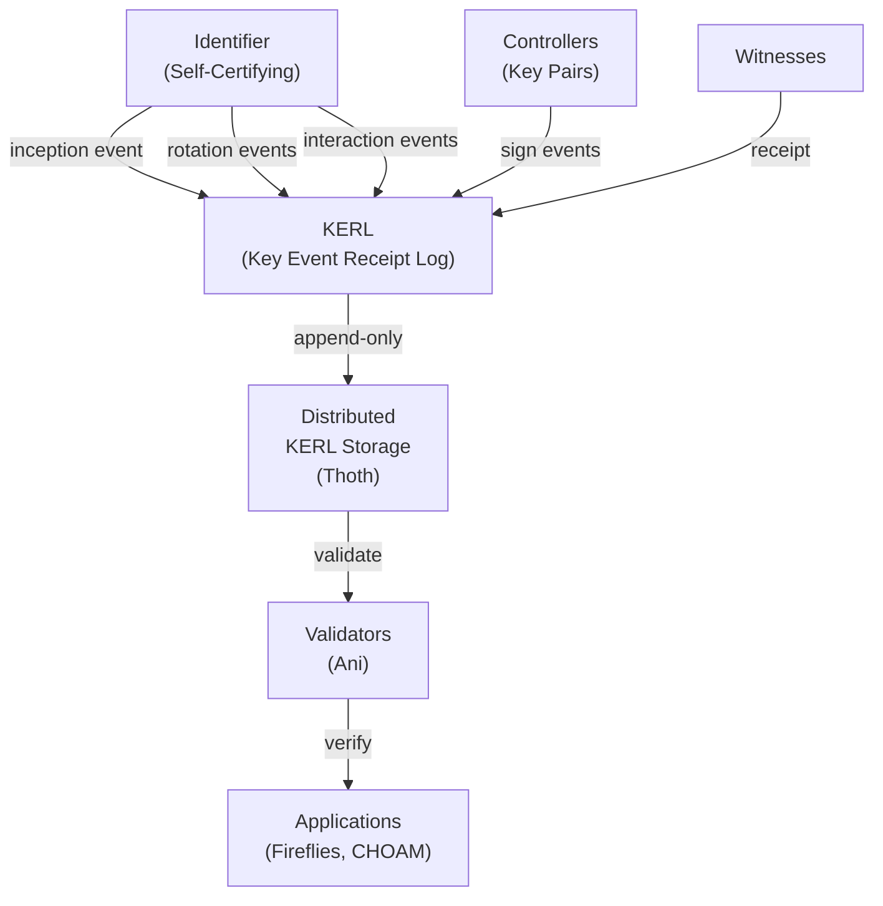

# Stereotomy

The Stereotomy module provides base trust and identifiers for the rest of Delos. Identifiers are autonomic, self-describing, self-certifying and decentralized.

## KERI Architecture Overview

Stereotomy is a faithful implementation of the [Key Event Receipt Infrastructure (KERI)](https://github.com/decentralized-identity/keri), providing a fully self-certifying decentralized identity system.

### KERI Design Model



### Key Concepts

**Identifier**: A self-describing, self-certifying identifier based on cryptographic digest of inception event. Format: `DigestAlgorithm:identifier`. Example: `E-SHA3_256:ABC123...`

**Key Event Receipt Log (KERL)**: Append-only, cryptographically signed log of all key events (inception, rotation, interaction) for an identifier. Provides non-repudiation and audit trail.

**Event Types**:
- **Inception (ICP)**: Creates identifier with initial key material and thresholds
- **Rotation (ROT)**: Rotates keys, maintains continuity through pre-rotated key digest
- **Interaction (IXN)**: Non-key-rotating event for signing operations

**Autonomic Identifier**: Identifier whose current validator is determined by its own KEL, not external authorities. Enables decentralized trust.

---

## Core Components

### Stereotomy Interface

Primary entry point for all identity operations.

```java
public interface Stereotomy {
    /**
     * Create a new identifier with the given parameters.
     * Issues inception event and stores in KERL.
     */
    ControlledIdentifier newIdentifier();

    /**
     * Create a new identifier with custom inception parameters.
     */
    ControlledIdentifier newIdentifier(InceptionParameters params);

    /**
     * Retrieve existing identifier by its digest.
     */
    Optional<KeyState> getKeyState(Digest identifier);

    /**
     * Get the KERL (Key Event Receipt Log) for an identifier.
     */
    KeyEventReceiptLog getKerl(Digest identifier);

    /**
     * Validate a key event - verify signature, ordering, and state consistency.
     */
    void validateEvent(KeyEvent event) throws InvalidKeyEventException;
}
```

### ControlledIdentifier Interface

Represents an identifier under local control with full key management.

```java
public interface ControlledIdentifier {
    /**
     * Get the identifier's digest.
     */
    Digest getIdentifier();

    /**
     * Get current key state (public keys, thresholds, next rotation key).
     */
    KeyState getCurrentKeyState();

    /**
     * Rotate to next key set. Returns new rotation event.
     * Pre-computed next key must have been set at inception.
     */
    KeyEvent rotate();

    /**
     * Sign a message using current key material.
     */
    Signature sign(byte[] message);

    /**
     * Create interaction event (non-key-rotating signature).
     */
    KeyEvent interact(byte[] payload);

    /**
     * Get the most recent key event.
     */
    KeyEvent getLastEvent();

    /**
     * Get sequence number of current state.
     */
    long getSequenceNumber();
}
```

### KeyState Interface

Represents the cryptographic material and operational parameters at a point in time.

```java
public interface KeyState {
    /**
     * Get all current public keys for this identifier.
     */
    List<PublicKey> getPublicKeys();

    /**
     * Get threshold required for valid signatures.
     */
    int getSignatureThreshold();

    /**
     * Get pre-computed next rotation key (for forward secrecy).
     */
    Digest getNextRotationKeyDigest();

    /**
     * Get threshold for next rotation.
     */
    int getNextRotationThreshold();

    /**
     * Get current sequence number.
     */
    long getSequenceNumber();

    /**
     * Get digest of this key state.
     */
    Digest getStateDigest();
}
```

---

## Usage Examples

### Example 1: Create a New Identifier

```java
// Initialize Stereotomy with in-memory KERL and key store
var entropy = SecureRandom.getInstance("SHA1PRNG");
var keyStore = new MemKeyStore();
var kerl = new MemKERL(DigestAlgorithm.DEFAULT);
var stereotomy = new StereotomyImpl(keyStore, kerl, entropy);

// Create a new autonomic identifier
var identifier = stereotomy.newIdentifier();

System.out.println("Identifier: " + identifier.getIdentifier());
System.out.println("Public Key: " + identifier.getCurrentKeyState().getPublicKeys().get(0));
System.out.println("Sequence: " + identifier.getSequenceNumber());

// Verify the inception event is in KERL
var kerl = stereotomy.getKerl(identifier.getIdentifier());
var inceptionEvent = kerl.getEvent(0);
System.out.println("Inception Event Type: " + inceptionEvent.getEventType()); // ICP
```

### Example 2: Rotate Keys

```java
// Get an existing identifier
var identifier = stereotomy.newIdentifier();
long initialSequence = identifier.getSequenceNumber();

// Rotate to next key set
var rotationEvent = identifier.rotate();
System.out.println("Rotation Event Sequence: " + rotationEvent.getSequenceNumber()); // initialSequence + 1

// Verify new key state
var newKeyState = identifier.getCurrentKeyState();
System.out.println("New public key: " + newKeyState.getPublicKeys().get(0));

// Sign message with rotated key
byte[] message = "Important transaction".getBytes();
var signature = identifier.sign(message);
System.out.println("Signature (hex): " + toHexString(signature.getSignature()));
```

### Example 3: Create and Validate Interaction Events

```java
var identifier = stereotomy.newIdentifier();

// Create interaction event (non-key-rotating signature)
byte[] payload = new byte[32]; // Your application data
new SecureRandom().nextBytes(payload);
var ixnEvent = identifier.interact(payload);

System.out.println("Interaction Event Type: " + ixnEvent.getEventType()); // IXN
System.out.println("Sequence: " + ixnEvent.getSequenceNumber());

// Validate the interaction event
try {
    stereotomy.validateEvent(ixnEvent);
    System.out.println("Interaction event validated successfully");
} catch (InvalidKeyEventException e) {
    System.err.println("Validation failed: " + e.getMessage());
}

// Retrieve the event from KERL to verify persistence
var kerl = stereotomy.getKerl(identifier.getIdentifier());
var retrievedEvent = kerl.getEvent(ixnEvent.getSequenceNumber());
assert retrievedEvent.equals(ixnEvent);
```

---

## Configuration

### Key Store Options

**MemKeyStore** (Development/Testing):
```java
var keyStore = new MemKeyStore();
var stereotomy = new StereotomyImpl(keyStore, kerl, entropy);
// Keys held in memory only - lost on restart
```

**FileKeyStore** (Production):
```java
var keyStore = new FileKeyStore(Paths.get("/secure/keystore"));
var stereotomy = new StereotomyImpl(keyStore, kerl, entropy);
// Keys persisted to encrypted file system
// Requires appropriate file system permissions and encryption
```

**PKCS11KeyStore** (Hardware Security Module):
```java
var config = new PKCS11Config()
    .setLibrary("/usr/lib/softhsm/libsofthsm2.so")
    .setSlot(0)
    .setPin("1234");
var keyStore = new PKCS11KeyStore(config);
var stereotomy = new StereotomyImpl(keyStore, kerl, entropy);
// Keys never leave HSM - suitable for production
```

### KERL Storage Options

**MemKERL** (Development/Testing):
```java
var kerl = new MemKERL(DigestAlgorithm.DEFAULT);
// Events held in memory only
```

**FileKERL** (Single-Node):
```java
var kerl = new FileKERL(Paths.get("/data/kerl"), DigestAlgorithm.DEFAULT);
// Events persisted to local file system
```

**DistributedKERL via Thoth** (Cluster):
```java
// KERL distributed across cluster via Thoth DHT
var kerlDHT = new KerlDHT(context, params);
var kerl = new DistributedKERL(kerlDHT);
// Events replicated to Thoth ring members
```

### Production Configuration Example

```yaml
# stereotomy-config.yaml
stereotomy:
  # Key Material
  keyStore:
    type: "PKCS11"
    library: "/usr/lib/softhsm/libsofthsm2.so"
    slot: 0
    pin: "${STEREOTOMY_PIN}"  # From environment variable

  # KERL Storage
  kerl:
    type: "distributed"  # Use Thoth DHT
    digestAlgorithm: "SHA3_256"

  # Key Rotation
  rotation:
    schedule: "weekly"  # Rotate keys weekly
    preCompute: true   # Pre-compute next rotation key
    backoffDays: 3     # Warning period before expiry

  # Witness Configuration
  witnesses:
    - "https://witness1.delos.io:8080"
    - "https://witness2.delos.io:8080"
    - "https://witness3.delos.io:8080"
  witnessThreshold: 2  # Require 2 of 3 witnesses
```

---

## Operational Procedures

### Key Rotation Schedule

Stereotomy supports automated or manual key rotation to maintain forward secrecy:

1. **Pre-Rotation Phase** (1 week before): Next rotation key digest published
2. **Rotation Window** (1 day): Execute rotation at system-determined time
3. **Grace Period** (3 days): Old keys still valid for verification
4. **Expiration** (after 3 days): Old keys no longer accepted

Rotation procedure:
```bash
# Check rotation status
./delos-cli identity status <identifier>

# Perform rotation (automated)
./delos-cli identity rotate --automatic

# Perform rotation (manual)
./delos-cli identity rotate --manual
```

### Backup and Recovery

**Full Backup**:
```bash
# Backup KERL and key material
tar czf delos-stereotomy-backup-$(date +%Y%m%d).tar.gz \
  /secure/keystore \
  /data/kerl

# Verify backup integrity
tar tzf delos-stereotomy-backup-*.tar.gz | head -20
```

**Recovery from Backup**:
```bash
# Restore from backup
tar xzf delos-stereotomy-backup-*.tar.gz -C /

# Verify recovery
./delos-cli identity verify --identifier <id>
```

### Migration Procedures

**Migrate from File-Based to HSM**:
1. Export keys from file keystore (encrypted)
2. Import keys into HSM via PKCS11 interface
3. Update configuration to use PKCS11KeyStore
4. Verify identifiers still accessible
5. Archive old keystore (encrypted)

---

## Security Considerations

### Non-Repudiation

All key events are cryptographically signed and immutable. Signers cannot deny having signed an event.

### Forward Secrecy

Pre-computed next rotation key digest (published at inception/rotation) ensures key rotation cannot be forged retroactively.

### Witness Thresholds

Configure witness requirements to match security model:
- **Development**: 1 witness acceptable
- **Production**: Require majority (f+1 out of 2f+1 witnesses)
- **High Security**: All witnesses must agree

### Key Material Protection

- **File Keystore**: Requires file system encryption (e.g., LUKS, FileVault)
- **PKCS11/HSM**: Keys never accessible to application code
- **In-Memory**: Only for testing; cryptographically cleared on shutdown

---

## Troubleshooting

### Identifier Not Found

```
Error: KeyState not found for identifier: E-SHA3_256:ABC123
```

**Cause**: Identifier not yet created or KERL not accessible
**Solution**:
- Verify identifier exists: `./delos-cli identity list`
- Check KERL storage connectivity if distributed
- Verify key store configuration

### Validation Failure

```
Error: InvalidKeyEventException - Signature verification failed
```

**Cause**: Event signature invalid or event corrupted
**Solution**:
- Verify event source authenticity
- Check witness receipts for event
- Inspect KERL for corruption: `./delos-cli kerl verify`
- Contact witness operators if persistent

### Key Rotation Blocked

```
Error: Cannot rotate - previous rotation incomplete
```

**Cause**: Previous rotation still in grace period or blocked
**Solution**:
- Check rotation status: `./delos-cli identity rotation-status`
- Wait for grace period to expire (3 days default)
- Contact security team if rotation blocked longer than expected

### HSM Connection Lost

```
Error: PKCS11KeyStore - HSM not responding
```

**Cause**: HSM unreachable or credentials invalid
**Solution**:
- Verify HSM power and network connectivity
- Re-insert smart card if applicable
- Verify PIN is correct
- Check HSM logs for errors

---

## Performance Characteristics

- **Identifier Creation**: ~10ms (in-memory), ~50ms (with file I/O)
- **Key Rotation**: ~50ms (in-memory), ~100ms (with witness verification)
- **Signature Generation**: ~5ms (Ed25519)
- **Signature Verification**: ~2ms (Ed25519)
- **Event Validation**: ~10ms (in-memory KERL), ~50ms (distributed KERL)

Bottlenecks typically occur with:
- KERL I/O (file or distributed storage)
- Witness receipt collection (network latency)
- HSM communication (PKCS11 overhead)

---

## Integration with Other Modules

- **[Thoth](../thoth/README.md)**: Distributed KERL storage via DHT
- **[Gorgoneion](../gorgoneion/README.md)**: Identity bootstrapping and credential issuance
- **[Fireflies](../fireflies/README.md)**: Member identification in Byzantine membership service
- **[CHOAM](../choam/README.md)**: Identifier-based node authentication
- **[Cryptography](../cryptography/README.md)**: Self-describing digests and signatures

---

## Security

Stereotomy underwent comprehensive security remediation as of January 2026, addressing 6 critical security considerations with formal threat modeling and validation. The module has been hardened against concurrency attacks, database corruption, and side-channel key extraction.

**Vulnerability Status:**
- 4 critical vulnerabilities fixed with code changes and test coverage
- 2 protocol design properties validated as intentional (not exploitable)
- 16+ dedicated security tests for concurrency, persistence, and key material handling
- Full threat model and security analysis documented

For detailed security analysis, attack vectors, mitigations, and test coverage, see [`docs/THREAT_MODEL.md`](./docs/THREAT_MODEL.md).

---

## Implementation Notes

Stereotomy is loosely based on the design of the foundation Java implementation of KERI. Stereotomy uses protobuf to encode and represent KERI events rather than focusing on JSON implementations. This provides efficient implementation and cryptographic processing.

**Design Rationale**:
- **Protobuf over JSON**: Smaller wire format, faster parsing, easier schema evolution
- **Pluggable Key Store**: Supports in-memory (testing), file (development), and PKCS11/HSM (production)
- **Pluggable KERL Storage**: Supports in-memory, file-based, and distributed (Thoth) storage
- **Direct Mode Initial**: Focuses on single-controller identifiers before integrating delegated mode

---

## Documentation and Resources

Developers working with Stereotomy (KERI implementation) can reference these documentation resources:

### Identity & KERI Architecture
- **[KERI Integration Guide](../docs/KERI_INTEGRATION.md)** - KERI architecture, key events, identifier lifecycle
- **[Architecture Guide](../docs/ARCHITECTURE.md)** - Stereotomy's role in identity/security layer
- **[Gorgoneion README](../gorgoneion/README.md)** - Identity bootstrapping using Stereotomy
- **[Fireflies README](../fireflies/README.md)** - Member identification via Stereotomy identifiers

### Security & Cryptography
- **[Security Threat Model](../docs/SECURITY_THREAT_MODEL.md)** - Threat model, attack surfaces, mitigations
- **[Cryptography Algorithms](../docs/CRYPTOGRAPHY_ALGORITHMS.md)** - ED25519, BLS-12-381, signature schemes
- **[Security Threat Model - Stereotomy](./docs/THREAT_MODEL.md)** - Module-specific threat analysis and vulnerabilities

### Development & Testing
- **[Testing Guide](../docs/TESTING_GUIDE.md)** - Test patterns, key event validation, deterministic testing
- **[Build Guide](../docs/BUILD.md)** - Building Stereotomy and dependent modules
- **[IDE Setup](../docs/IDE_SETUP.md)** - Development environment configuration

### Operations & Deployment
- **[Configuration Guide](../docs/CONFIGURATION_GUIDE.md)** - Key store configuration, PKCS11 integration
- **[Operational Checklists](../docs/OPERATIONAL_CHECKLISTS.md)** - Key rotation procedures, bootstrap checklist
- **[Hardware Requirements](../docs/HARDWARE_REQUIREMENTS.md)** - HSM requirements, key management hardware
