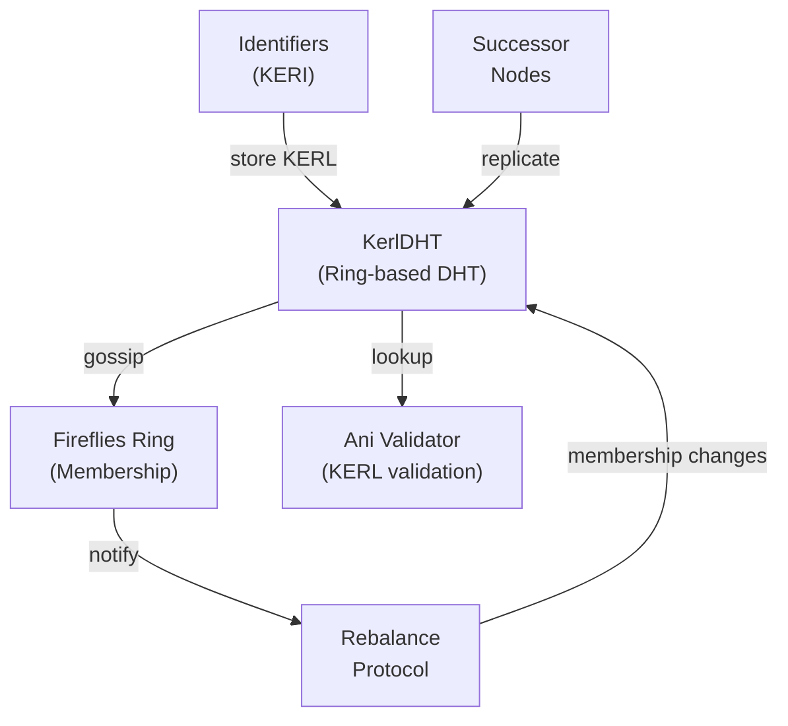

# Thoth

KERI KERL, Validation, Witnessing, and DHT storage at scale.

---

## Distributed Hash Table for KERL Storage

Thoth provides a unified KERL in the form of a **KerlDHT** - a distributed hash table that is Byzantine fault-tolerant, highly scalable, and designed specifically for distributed identity management.

### Architecture Overview



### How It Works

1. **Ring Mapping**: Identifier digest mapped to Fireflies ring using consistent hashing
2. **Successors**: Nodes succeeding identifier in ring store replicated copies
3. **Rebalancing**: When membership changes, gossip protocol automatically rebalances KERL data
4. **Byzantine Safety**: Requires quorum of successors to confirm storage (3f+1 nodes for f failures)

---

## Core Components

### KerlDHT Interface

Primary entry point for distributed KERL operations.

```java
public interface KerlDHT {
    /**
     * Store a KERL (key event receipt log) entry in the DHT.
     * Automatically replicates to successor nodes.
     * Returns after quorum confirmation.
     */
    void store(Digest identifier, KeyEvent event) throws IOException;

    /**
     * Retrieve a KERL entry from the DHT.
     * Queries successors until response obtained.
     * Verifies signature against membership.
     */
    KeyEvent retrieve(Digest identifier, long sequenceNumber) throws IOException;

    /**
     * Get all events for an identifier from the DHT.
     * Fetches complete KERL from successors.
     */
    List<KeyEvent> retrieveKerl(Digest identifier) throws IOException;

    /**
     * Validate that storage requirements are met for an identifier.
     * Checks that sufficient replicas exist.
     */
    boolean validateStorage(Digest identifier) throws IOException;

    /**
     * Gossip rebalance when membership changes.
     * Called by membership service on view changes.
     */
    void rebalance(Context context) throws IOException;

    /**
     * Get replication factor (number of successor replicas).
     */
    int getReplicationFactor();
}
```

### Ani Key Event Validation

KERI validation functionality is provided by **Ani**, which validates key events in two contexts:

#### Root Validation

```java
public interface RootEventValidation extends EventValidation {
    /**
     * Validate key event against root identifiers.
     * Used during bootstrap to establish initial trust anchors.
     * Only root identifiers can perform inception events.
     */
    void validate(KeyEvent event) throws ValidationException;
}
```

This *EventValidation* implementation only validates against the *root* identifiers of the *Ani* instance. Roots are typically governance identifiers established at system bootstrap. This validator is used for bootstrapping members into the Delos Fireflies membership.

#### KERL Set Validation

```java
public interface KerlSetEventValidation extends EventValidation {
    /**
     * Validate key event against full KERL (Key Event Receipt Log).
     * Used for general identifier validation in running system.
     * Verifies:
     * - Event signature against current key state
     * - Witness thresholds met
     * - Rotation sequence unbroken
     * - No duplicate events
     */
    void validate(KeyEvent event) throws ValidationException;
}
```

This *EventValidation* implementation uses the full KERL set validation, validating all key events in the identifier's event receipt log against configured witnesses and thresholds. This validator is used for general-purpose identifier validation within the Fireflies membership context after bootstrap is complete.

### Thoth Validation Service

Thoth also provides validation and witnessing services to provide a full-featured public key infrastructure for the rest of the Delos stack.

```java
public interface ThothValidator {
    /**
     * Validate an identifier's complete KERL.
     * Checks all events, witnesses, and state consistency.
     */
    ValidationResult validate(Digest identifier) throws IOException;

    /**
     * Get validation status of an identifier.
     */
    IdentifierStatus getStatus(Digest identifier);

    /**
     * Invalidate cached validation results (after update).
     */
    void invalidate(Digest identifier);
}

public class IdentifierStatus {
    public enum Status { VALID, INVALID, UNKNOWN, PENDING }

    public Status status;
    public Instant lastValidated;
    public String details;
}
```

---

## Usage Examples

### Example 1: Create and Use KerlDHT

```java
// Initialize Thoth with context from Fireflies membership
var context = fireflies.getView();
var consensusParams = new ConsensusParameters();
var kerlDHT = new KerlDHT(context, consensusParams);

// Store KERL entry in distributed DHT
var identifier = stereotomy.newIdentifier();
var inceptionEvent = identifier.getLastEvent();
kerlDHT.store(identifier.getIdentifier(), inceptionEvent);

System.out.println("Event stored in DHT - replicated to " +
                   kerlDHT.getReplicationFactor() + " nodes");

// Retrieve from DHT (may come from successor nodes)
var retrievedEvent = kerlDHT.retrieve(
    identifier.getIdentifier(),
    inceptionEvent.getSequenceNumber()
);
assert retrievedEvent.equals(inceptionEvent);

System.out.println("Successfully retrieved event from DHT");
```

### Example 2: Complete KERL Distribution

```java
var kerlDHT = new KerlDHT(context, params);
var identifier = stereotomy.newIdentifier();

// Store inception event
var inceptionEvent = identifier.getLastEvent();
kerlDHT.store(identifier.getIdentifier(), inceptionEvent);

// Perform rotation and store rotation event
var rotationEvent = identifier.rotate();
kerlDHT.store(identifier.getIdentifier(), rotationEvent);

// Interaction event
var ixnEvent = identifier.interact(new byte[32]);
kerlDHT.store(identifier.getIdentifier(), ixnEvent);

// Later: retrieve complete KERL from any node in cluster
List<KeyEvent> kerl = kerlDHT.retrieveKerl(identifier.getIdentifier());
System.out.println("Retrieved KERL with " + kerl.size() + " events:");
for (KeyEvent event : kerl) {
    System.out.println("  - " + event.getEventType() +
                      " at sequence " + event.getSequenceNumber());
}
```

### Example 3: Validate Identifier Against KERL Set

```java
// Create Ani validator with KERL set validation
var kerlDHT = new KerlDHT(context, params);
var ani = new Ani(kerlDHT);  // Root validation OR KERL set validation

// Validate an identifier's full KERL
var identifier = stereotomy.newIdentifier();
var validationResult = ani.validate(identifier.getIdentifier());

if (validationResult.isValid()) {
    System.out.println("Identifier is valid");
    System.out.println("Witness threshold: " + validationResult.getWitnessThreshold());
    System.out.println("Events validated: " + validationResult.getEventCount());
} else {
    System.err.println("Validation failed: " + validationResult.getErrors());
}

// Invalidate cache after rotation
identifier.rotate();
ani.invalidate(identifier.getIdentifier());

// Re-validate with new state
validationResult = ani.validate(identifier.getIdentifier());
```

---

## Configuration

### DHT Ring Parameters

```yaml
thoth:
  dht:
    # Replication factor: how many replicas per identifier
    replicationFactor: 3

    # Ring topology based on Fireflies context
    # Automatically maps to membership ring

    # Rebalance parameters
    rebalance:
      # How often to check if rebalancing needed (on membership change)
      enabled: true
      # Batch size for gossip rebalance
      batchSize: 100
```

### Ani Validation Configuration

```yaml
thoth:
  validation:
    # Root identities for bootstrap validation
    roots:
      - "E-SHA3_256:ABCDEF..."  # Governance identifier 1
      - "E-SHA3_256:123456..."  # Governance identifier 2

    # Witness configuration
    witnesses:
      # Minimum witnesses required for valid events
      threshold: 2
      # Total witnesses configured
      total: 3

    # Rotation parameters
    rotation:
      # Pre-rotated key validation window
      lookAhead: 1  # events

    # Clock skew tolerance for timestamps
    clockSkew: "PT5M"  # 5 minutes
```

### Production Configuration Example

```yaml
# thoth-config.yaml
thoth:
  replicationFactor: 3

  # Use for root validation during bootstrap
  roots:
    - "${ROOT_IDENTIFIER_1}"
    - "${ROOT_IDENTIFIER_2}"

  witnesses:
    - "https://witness1.delos.io:8443"
    - "https://witness2.delos.io:8443"
    - "https://witness3.delos.io:8443"
  witnessThreshold: 2

  # Clock skew in cluster
  clockSkew: "PT1M"

  # Rebalance on membership change
  rebalance:
    enabled: true
    batchSize: 100
```

---

## Operational Procedures

### Monitor DHT Health

```bash
# Check replication factor for identifier
./delos-cli thoth status --identifier E-SHA3_256:ABC123

# Output:
# Identifier: E-SHA3_256:ABC123
# Successors: 3
# Replicas: 3
# Status: OK

# Check for under-replicated identifiers
./delos-cli thoth replication-report

# Output:
# Under-replicated (< 3 replicas): 0
# At risk (2 replicas): 2
#   E-SHA3_256:XYZ789 (replicas: 2)
```

### Manual Rebalance

```bash
# Trigger rebalance after membership change
./delos-cli thoth rebalance

# Rebalancing: 450 identifiers
# Progress: ████████████░░░░░░░░░░░░░░░░░░░░░░░░░░░░░░ 35%
# Complete

# Verify rebalance success
./delos-cli thoth verify-rebalance
# All identifiers properly replicated: OK
```

### Query KERL from DHT

```bash
# Retrieve complete KERL for identifier
./delos-cli kerl get --identifier E-SHA3_256:ABC123 --output json

# Output:
# {
#   "identifier": "E-SHA3_256:ABC123",
#   "events": [
#     {
#       "sequence": 0,
#       "type": "ICP",
#       "timestamp": "2026-01-28T12:00:00Z",
#       "signature": "..."
#     },
#     ...
#   ]
# }

# Validate KERL integrity
./delos-cli kerl validate --identifier E-SHA3_256:ABC123
# Validation: PASS
# - Inception event signature: OK
# - Rotation sequence unbroken: OK
# - Witness thresholds met: OK (2 of 3)
```

---

## Performance Characteristics

### Storage

- **Space per identifier**: ~500 bytes (inception) + ~300 bytes (per event)
- **Replication overhead**: 3x (with replicationFactor=3)
- **Example**: 1M identifiers with 10 events each = ~4.3GB per node

### Lookup Performance

| Operation | Latency | Notes |
|-----------|---------|-------|
| Store event | 50-100ms | Includes quorum confirmation |
| Retrieve single event | 10-50ms | From successor cache |
| Retrieve full KERL | 100-500ms | Depends on KERL size |
| Rebalance (10K identifiers) | 5-10 seconds | Background gossip |

### Scaling

- **Small cluster (3-5 nodes)**: ~100K identifiers max
- **Medium cluster (7-10 nodes)**: ~1M identifiers
- **Large cluster (20+ nodes)**: ~10M identifiers
- **Bottleneck**: Gossip rebalance scales as O(n * membership_changes)

---

## Witness Network Integration

Thoth integrates with witness networks to provide non-repudiation:

```java
// Witness configuration in Ani
var witnessConfig = new WitnessConfig()
    .addWitness("https://witness1.delos.io:8443")
    .addWitness("https://witness2.delos.io:8443")
    .addWitness("https://witness3.delos.io:8443")
    .setThreshold(2);  // Require 2 of 3

// Validate against witness receipts
var ani = new Ani(kerlDHT, witnessConfig);
var result = ani.validate(identifier);
System.out.println("Witness receipts obtained: " + result.getWitnessCount());
```

---

## Troubleshooting

### Under-Replicated Identifiers

```
Warning: Identifier E-SHA3_256:ABC123 has only 1 replica (expected 3)
```

**Cause**: Node failure or rebalance delayed after membership change
**Solution**:
- Trigger manual rebalance: `./delos-cli thoth rebalance`
- Wait for gossip protocol to complete (5-10 seconds)
- Monitor successor nodes for health issues

### Validation Failure

```
Error: ValidationException - Event E-SHA3_256:ABC123@5 failed validation
  Missing witness receipt from witness2.delos.io
```

**Cause**: Event not witnessed by required threshold
**Solution**:
- Check witness connectivity: `./delos-cli witness-status`
- Verify witness thresholds: `./delos-cli thoth config`
- Contact witness operator if persistent

### DHT Consistency Errors

```
Error: Inconsistent KERL retrieved from different successors
  Node A sequence 10, Node B sequence 8
```

**Cause**: Rebalance in progress or network partition
**Solution**:
- Wait for rebalance to complete (~10 seconds)
- Check network connectivity between nodes
- If persistent, perform full KERL recovery from stable node

### Rebalance Stuck

```
Warning: Rebalance in progress for >30 minutes
  Processed: 50K / 100K identifiers
```

**Cause**: Network issues or successor nodes slow
**Solution**:
- Check network connectivity and latency
- Check successor node health (CPU, disk, memory)
- If necessary, abort and retry: `./delos-cli thoth rebalance --abort`

---

## Design Rationale

### Why DHT for KERL Storage?

1. **Scalability**: Distributed storage avoids single bottleneck
2. **Resilience**: Replication provides fault tolerance
3. **Decentralization**: No central authority required
4. **Byzantine Safety**: Quorum-based validation ensures safety
5. **Efficiency**: Gossip protocol enables background rebalance

### Why Ring-Based Mapping?

1. **Consistency**: Same identifier always maps to same successors
2. **Locality**: Identifier storage close to validators (Fireflies ring)
3. **Membership-Aware**: Automatically adapts to cluster changes
4. **Efficient Rebalance**: Only affected identifiers rebalanced on change

### Why Separate Root and KERL Validation?

1. **Bootstrap**: Root validation establishes trust with minimal data
2. **Production**: KERL validation provides full audit trail
3. **Efficiency**: Root validation faster for repeated operations
4. **Flexibility**: Different validation rules per context

---

## Integration with Other Modules

- **[Stereotomy](../stereotomy/README.md)**: Provides KERL events for storage
- **[Fireflies](../fireflies/README.md)**: Ring topology and membership
- **[Gorgoneion](../gorgoneion/README.md)**: Identity bootstrapping using Thoth validation
- **[CHOAM](../choam/README.md)**: Identifier authentication using KERL validation

---

## Implementation Notes

Thoth uses the **Fireflies** membership ring as its DHT ring topology. This co-locates KERL storage with the consensus layer, enabling efficient Byzantine-fault-tolerant storage without additional infrastructure.

**Key Design Decisions**:
- **Ring-based DHT**: Leverages Fireflies topology
- **Gossip Rebalance**: Background rebalancing on membership change
- **Quorum Confirmation**: Requires 3f+1 confirmation for Byzantine safety
- **Dual Validation**: Root (bootstrap) and KERL set (runtime) validators
- **Witness Integration**: External witnesses provide non-repudiation
